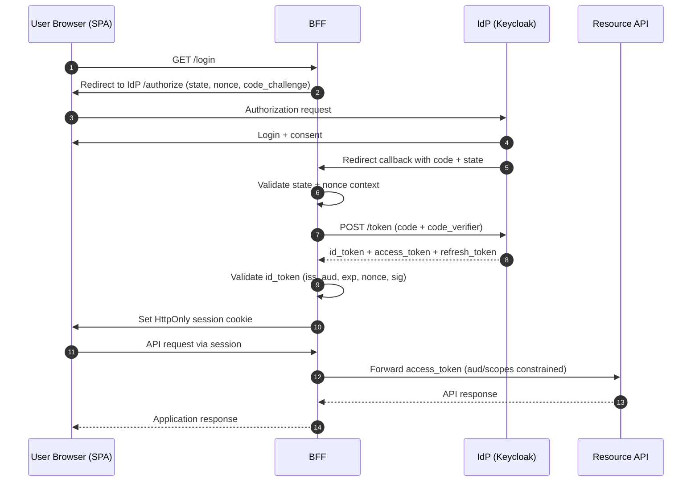

# Security Playbook for OIDC + OAuth 2.0

## 1. Scope and Objective

This playbook describes secure OIDC (authentication) and OAuth 2.0 (authorization) integration with Keycloak.

---

## 2. OIDC + OAuth 2.0 Workflow and Token Purpose

- **OIDC** handles user login and identity context via `id_token`
- **OAuth 2.0** handles delegated API access via `access_token`/`refresh_token`
- In Authorization Code flow, both are used together in one end-to-end sequence

### 2.1 Sequence (Authorization Code + PKCE, SPA + BFF pattern)

### 2.2 Token sets by flow

1. `authorization_code` (with OIDC scope):
- `id_token` + `access_token` + often `refresh_token`

2. `authorization_code` (without OIDC scope):
- `access_token` + often `refresh_token`, no `id_token`

3. `client_credentials`:
- only `access_token` (usually no refresh token)

4. `token exchange` (RFC 8693, Keycloak V2):
- input token -> new `access_token` (different audience/scope)

5. `offline_access` (scope, not flow):
- `offline_access` is an OAuth scope that changes refresh token semantics
- when requested and granted, an offline token is issued with long-lived or non-session-bound behavior
- this is not a separate grant flow, but token behavior modification in existing flows (for example, authorization_code)

### 2.3 Purpose of each token

- `id_token`: user authentication result for client session context
- `access_token`: bearer presented to resource server for authorization
- `refresh_token`: gets new access tokens without full re-login
- `offline token`: gets new tokens without active browser session
- `userinfo` response: optional source of additional profile claims, not a replacement for `id_token` validation

Identity rule:
- Use `sub` as primary stable user identifier in application
- Do not use `email` as primary identity key

### 2.4 Critical security rules

- Never use `id_token` as API bearer
- Keep `aud` and `scope` narrow
- Use explicit numeric token/session limits (see section 5), not vague "short/long" wording
- PKCE is mandatory for public clients

What PKCE is and why it is needed:
- PKCE (`Proof Key for Code Exchange`) adds a `code_challenge`/`code_verifier` pair to Authorization Code flow.
- It protects against authorization code interception: even if the code is stolen in redirect/callback paths, it cannot be exchanged for tokens without the `code_verifier`.

---

## 3. Recommended Architecture Patterns

### 3.1 Web Backend (server-rendered)

- Confidential client
- Authorization Code flow
- PKCE enabled (recommended even for confidential clients)
- Tokens are stored on backend
- Browser receives only session cookie

### 3.2 SPA + BFF (recommended for browser)

- SPA (`Single-Page Application`) is the browser-side frontend (JavaScript app) running in the user browser.
- BFF (`Backend for Frontend`) is a dedicated server-side backend for that frontend.
- SPA does not store refresh token
- BFF performs code exchange and stores refresh token server-side
- SPA talks to BFF through protected cookie-based session
- BFF calls APIs on behalf of user

### 3.3 Mobile

- Public client
- Authorization Code + PKCE (`S256`)
- System browser only (ASWebAuthenticationSession / Custom Tabs)
- Refresh token stored only in OS secure storage

### 3.4 Service-to-service

- OAuth Client Credentials
- Separate machine clients and scopes/roles
- Do not mix user tokens and service tokens

---

## 4. Protection Profile Matrix (Recommended vs Maximum)

Maximum profile is defined as a **delta** to Recommended: the Maximum column lists only additional or stricter requirements.
Reading rule for controls below:
- If a bullet has no tag, it applies to both profiles (`R+M`)
- Maximum-only hardening is grouped under dedicated "Maximum profile hardening" blocks

| Control | Recommended (R) | Maximum (M) | Rationale / Threat |
|---|---|---|---|
| Flow and base client model | Authorization Code + PKCE (`S256`), SPA+BFF/server-side web app, mobile public + system browser, service confidential + client_credentials | In addition to R: mandatory strict client policies at IdP level | Reduces code interception risk, token misuse, and misconfiguration drift |
| Sender-constrained tokens | Not mandatory by default | In addition to R: DPoP and/or mTLS, minimum refresh-token binding for public clients | Reduces impact of bearer token theft and replay |
| PAR/JAR | Not mandatory by default | In addition to R: PAR (RFC 9126) + JAR (RFC 9101) for critical clients | Protects authorization parameters from tampering/mix-up, reduces front-channel risks |
| MFA/step-up | Risk-based according to business policy | In addition to R: mandatory MFA/step-up for critical operations | Protects against account takeover and unauthorized privilege escalation |
| Token TTL/rotation | Short TTLs, refresh token rotation, explicit numeric limits from section 5 | In addition to R: stricter TTLs and degraded windows for high-risk environments | Reduces exploitation window for compromised tokens |
| Token validation | `iss/aud/exp/nbf/iat/signature`, `alg` allowlist, `nonce`, `azp`, policy checks | In addition to R: mandatory holder-of-key validation for sender-constrained tokens | Protects against forged/misissued tokens, mix-up, and key confusion |
| Session/Cookies | HttpOnly/Secure/SameSite, narrow Domain/Path, session ID rotation, CSRF controls | In addition to R: no cross-origin on session-bound endpoints without approved exception | Protects against XSS cookie theft, CSRF, fixation, cookie scope abuse |
| Logout/Revocation | RP-initiated logout + local logout + refresh revocation | In addition to R: mandatory introspection for sensitive APIs in post-logout/post-incident windows | Reduces replay after logout and accelerates revocation effect |
| Key management | Planned signing key rotation, trusted JWKS/issuer pinning | In addition to R: faster cadence and stricter emergency cutover SLA | Reduces blast radius in key compromise events |
| Operations/Monitoring | Baseline rate limits, lockout signals, auth/token anomaly monitoring | In addition to R: stronger anti-automation controls, stricter alerting and SLOs | Reduces brute-force/abuse and improves incident MTTR |

---

## 5. Unified Numeric Baseline (single source of truth)

All numeric limits for token/session/replay/rate-limiting are defined here. Other sections should reference this baseline instead of duplicating values.

### 5.1 Token and session timing

- Access token TTL: `5-15m` (default: `10m`)
- ID token TTL: `<=5m`
- Browser/BFF refresh token absolute max lifetime: `<=24h`
- Mobile refresh token absolute max lifetime: `<=30d` only with secure enclave/keystore storage and device trust controls
- Refresh token reuse grace window (retry races): `<=30s`
- User session idle timeout (browser): `15m`
- User session max age (browser): `8h`
- Fresh auth (`max_age`) for high-risk operations: `<=15m`
- JWT/client clock skew tolerance: `<=60s` (hard limit: `<=120s`)

### 5.2 Replay and rate-limiting baseline

- Token endpoint rate limit (per client + source IP): `60 req/min` sustained
- Burst budget: `120 req/min` within `<=1m`
- Brute-force lockout signal: `10` failed attempts in `5m`
- Callback state/nonce TTL: `<=10m`, single-use
- Introspection timeout budget: connect `<=100ms`, response `<=300ms`, total `<=500ms`
- Introspection cache TTL: positive `<=30s` (never above token `exp`/`Not Before`), negative `<=5s`
- Allowed degraded `fail-open` window only for low-risk class C and only by exception: `<=120s`

### 5.3 Maximum profile hardening

- For high-risk/regulated environments: tighten TTLs and max degraded windows relative to baseline values
- For high-risk/regulated environments: use stricter rate-limiting/burst/cache/degraded windows

---

## 6. Control Domains

### 6.1 Identity Flow

- Use Authorization Code + PKCE (`S256`) for browser/mobile user login
- Enforce strict callback integrity checks: `state` is mandatory and must match request->callback exactly
- `nonce` is mandatory for OIDC login and must match original authorization request value
- Redirect/logout URIs: exact match only and separate lists per environment
- Block deprecated grants (`implicit`, `password`) unless explicitly approved exception exists

Maximum profile hardening:
- Enable PAR/JAR for critical clients and elevated-risk flows

### 6.2 Token Security

- Validate `iss`, `aud`, `exp`, `nbf`, `iat`, signature (`kid`/JWKS)
- Enforce JWT `alg` allowlist and reject unexpected algorithms
- Validate `azp` when present (especially with multiple audiences)
- Validate authorization scopes + roles + policy (deny-by-default)
- Never use `id_token` as API bearer
- Use short TTL/rotation and explicit audience (see section 5)
- Keep `Revoke Refresh Token` enabled (rotation)
- Introspection is mandatory for high-risk operations, suspicious tokens, and post-incident windows

Maximum profile hardening:
- Enable sender-constrained tokens (DPoP and/or mTLS)
- For public clients: minimum bind refresh token, preferably refresh + access
- Verify holder-of-key validation support in adapters/runtime for DPoP/mTLS

### 6.3 Session and Cookies

- Browser stores session cookie only; refresh/offline tokens in browser storage are forbidden
- Application server stores session state (Redis/DB/in-memory with replication)
- Rotate session ID after login callback and after privilege elevation
- Cookie `HttpOnly`: blocks JS access and reduces XSS-driven cookie theft
- Cookie `Secure`: sends cookie over HTTPS only, reducing in-transit interception risk
- Cookie `SameSite=Lax` (or `None; Secure` for cross-site SSO): reduces CSRF/login CSRF risk
- Narrow `Domain`/`Path`: reduces cross-app leakage and cookie tossing/subdomain takeover impact
- CSRF protection is mandatory for state-changing BFF endpoints (`POST/PUT/PATCH/DELETE`): synchronizer token or double-submit cookie
- Validate `Origin` (primary) and `Referer` (fallback) for browser state-changing requests
- Apply same-origin policy for session-bound endpoints and enforce `Sec-Fetch-Site` checks

Maximum profile hardening:
- For session-bound endpoints, do not allow cross-origin CORS without explicitly approved exception

### 6.4 Logout and Revocation

- Implement secure logout flow: local session destroy -> RP-initiated logout -> strict `post_logout_redirect_uri`
- Revoke refresh token on logout via `/protocol/openid-connect/revoke` (RFC 7009)
- For multi-RP ecosystems, configure back-channel/front-channel logout with fallback behavior
- For global incidents, use `Sign out all active sessions` + realm/client `Not Before`
- Treat sign-out alone as insufficient for already issued access tokens until `exp` (see section 5)
- For sensitive APIs, introspection is mandatory in `<=15m` window after logout/revocation/Not Before update
- Reject tokens that are inactive, issued before `Not Before`, or violate binding context

Maximum profile hardening:
- Expand mandatory introspection scope to additional endpoint classes

### 6.5 Key Management

- Validate JWT signatures only against trusted JWKS (`/protocol/openid-connect/certs`) from expected issuer
- `kid` must resolve to active JWKS key; untrusted/user-controlled JWKS URLs are forbidden
- Planned realm signing key rotation is mandatory
- Rotation model: introduce new key in advance (active/passive), retire old key only after compatibility window
- Emergency compromise response: immediate new key issuance and session/token invalidation
- Baseline cadence: signing key rotation every `90d`, overlap `24-72h`, emergency cutover `<=1h`
- HTTPS only; mTLS for trusted internal channels where required by threat model
- For confidential clients prefer `private_key_jwt` or mTLS; allow `client_secret` only with mandatory rotation

Maximum profile hardening:
- Tighten rotation cadence and emergency SLA for regulated/high-risk environments

### 6.6 Operations and Monitoring

- Centralize JWT/introspection validation in middleware and preserve deny-by-default authorization
- Enable IdP admin/user event auditing and SIEM correlation between auth and API events
- Monitor token endpoint errors, refresh failures, invalid signature, invalid audience, token-exchange/DPoP failures
- Capture and alert on replay signals (`state`/`nonce` reuse, repeated callback correlation IDs)
- For introspection, use circuit breaker + backoff + automatic policy normalization after confirmed recovery
- Define per-endpoint-class behavior:
  - Class A (money movement/admin/privilege changes/PII export): `fail-closed`
  - Class B (state-changing business operations): `fail-closed`
  - Class C (low-risk read-only): explicit decision; `fail-open` only by approved exception

Maximum profile hardening:
- Strengthen anti-automation controls and alerts (lower thresholds, faster response SLA)

---

## 7. Threat-Driven Checks (Mandatory in Review)

- Authorization code interception -> PKCE + exact redirect URI
- Bearer token theft -> short TTL + sender-constrained tokens where risk profile requires
- Refresh token reuse -> rotation + reuse detection
- Open redirect -> strict allowlist
- Mix-up attacks -> `iss` validation + strict client/issuer config
- Privilege escalation -> strict audience/scope/role separation
- Session fixation -> session ID rotation after login
- Token leakage in logs -> redaction and explicit no-token logging policy

---

## 8. Anti-patterns

- Using `id_token` as API bearer
- PKCE `plain` instead of `S256`
- Wildcard redirect URI
- Storing refresh token in browser storage
- Long access token TTL (hours/days)
- Single client for user login and machine-to-machine traffic without segregation
- Missing key rotation and missing key-compromise response procedure

---

## 9. Step-by-Step Integration with Keycloak

### Step 1. Realm and cryptography baseline

- Configure realm keys and rotation plan (see Key Management domain)
- Enable admin/user event audit
- Verify HTTPS and correct proxy header handling

### Step 2. Create client types

- `web-bff` (confidential)
- `spa-frontend` (if separate public client is needed)
- `mobile-app` (public + PKCE)
- `service-api-client` (confidential + `client_credentials`)

### Step 3. Lock redirect/logout URIs

- Exact match only
- Separate URI sets per environment
- Configure `Valid Post Logout Redirect URIs`

### Step 4. Enable secure capabilities

- Standard Flow: ON
- Implicit: OFF
- Direct Access Grants: OFF (unless explicitly approved business need)
- PKCE method: `S256`
- Revoke Refresh Token: ON (typically)

Maximum profile hardening:
- Enable PAR/JAR and sender-constrained tokens for selected high-risk clients

### Step 5. Configure scopes/roles/audience

- Minimal client scopes
- Separate API client roles
- Audience mapping to exact resource servers

### Step 6. Integrate application

- Use `.well-known/openid-configuration` as endpoint source
- Pin trust to expected `issuer` and use only that issuer's `jwks_uri`
- Keep browser session cookie, not bearer tokens in browser storage
- In callback, strictly validate `state` and `nonce` before creating local session

### Step 7. Build resource server middleware

- Centralize JWT/introspection validation
- Enforce `iss/aud/exp/nbf` and scope/role checks
- Preserve deny-by-default authorization

### Step 8. Implement logout/revocation/invalidation

- Implement RP-initiated logout
- Implement refresh-token revocation path
- Prepare incident runbook for mass `Not Before`

### Step 9. Monitoring and detection

- Implement the metrics and alerts set from Operations/Monitoring domain
- Maintain response runbook for replay/brute-force/token-abuse signals
