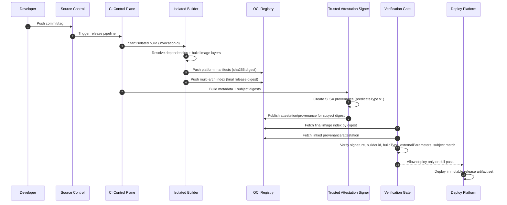

# SLSA Provenance (v1.2) for Container Images: Overview

## 1. Scope and objective

This overview describes how to apply `SLSA v1.2` to a CI/CD pipeline that builds and publishes container images.

Objective:
- provide verifiable traceability `source -> build -> image digest`
- reduce risk of artifact tampering, metadata forgery, and unauthorized build influence

SLSA adoption trace in this document:
- define the target pipeline maturity level first
- then set mandatory requirements for producer/build platform
- then formalize the threat model
- then present the reference CI/CD model and map verification by stage
- finally define policy gates and a minimal phased implementation recipe

---

## 2. Target maturity model: L1 -> L2 -> L3

### 2.1 Build L1

- provenance exists and describes how the image was built
- benefit: visibility and process traceability
- limitation: weak resistance to forgery

### 2.2 Build L2

- provenance is generated/signed by a hosted build platform
- verifier checks signature and builder identity
- baseline for production supply chains

### 2.3 Build L3

- stronger resistance to provenance forgery by tenant process
- build isolation, ephemeral environment, and protected signing secrets
- `externalParameters` must be complete (no hidden channel for external influence on the build)
- target level for most production releases

---

## 3. Pipeline requirements (producer + build platform)

### 3.1 Source and invocation controls

- canonical repo/revision only for release branches
- explicit policy for allowed trigger types (tag, protected branch)
- deny unauthorized runtime build parameters

### 3.2 Build environment controls

- hosted runners for release builds
- one-build-one-ephemeral-environment
- no shared mutable state across concurrent builds
- treat cache as untrusted input; release pipelines must enforce cache-safe controls (scoped cache keys, provenance-consistent inputs), with optional no-cache rebuilds for high-risk releases

### 3.3 Artifact controls

- publish and enforce policy only by digest (`sha256:...`), not mutable tag
- multi-arch: validate each manifest digest independently

---

## 4. Threat model (overview)

Core scenarios the pipeline must cover:
- building from non-canonical source (fork/branch/tag drift)
- `externalParameters` tampering to inject unauthorized behavior
- provenance/signature forgery after build
- tampering in registry/transit
- cross-build influence (cache poisoning, persistence between builds)

Minimum mapping to SLSA verification:
- step 1: provenance authenticity + `subject` match
- step 2: expectation match (`builder.id`, source, `buildType`, parameters)
- step 3: dependency checks (`resolvedDependencies`) as best effort/recursive

---

## 5. Reference CI/CD model for container images

### 5.1 Delivery flow

`commit/tag -> CI trigger -> isolated build -> image push (digest) -> provenance generation/signing -> attestation publish -> verification gate -> deploy`

### 5.2 Key trust boundaries

- developer/workstation
- source control system
- build platform control plane
- attestation signer service (part of build platform control plane)
- user-defined build steps (tenant workload)
- registry/distribution layer
- deployment control plane (admission/policy engine)

### 5.3 Sequence diagram: final artifact formation



### 5.4 How to read the diagram: trusted and risk paths

Trusted release path:
- trigger from canonical source
- isolated build inside trusted build platform
- digest-only artifact publication
- provenance generated by trusted attestation signer
- policy-based verification gate before deployment

Higher-risk paths (focus points):
- any non-canonical source/trigger before build starts
- runtime parameters outside approved `externalParameters` schema
- shared state/cache enabling cross-build influence
- any tenant-step access attempt to signer service/secrets
- deployment by mutable tag without attestation/provenance verification

Operational rule:
- the attestation signer belongs to the trusted build platform control plane; tenant build steps must not have direct access to it and must not have access to provenance signing secrets

### 5.5 What to verify at each stage

- pre-build: canonical source/revision + allowed trigger
- post-build: subject digest + provenance envelope authenticity
- pre-deploy: `predicateType`, `builder.id`, issuer/identity, `buildType`, `externalParameters` schema, anti-replay
- post-deploy: persist gate pass/fail in audit trail

Final release artifact set:
- OCI image index digest (immutable reference)
- platform-specific image manifests/layers
- SLSA provenance attestation linked to artifact digest
- verification gate result (pass/fail) in audit trail

---

## 6. Attestation/provenance distribution

### 6.1 Where to publish

Recommended minimum:
- primary: in the same OCI repository, explicitly linked to artifact digest via `subject`/referrers
- secondary: additional location only as backup/disaster channel (for example, release assets)

### 6.2 Artifact <-> attestation relationship

- support one-to-many (multiple attestations per artifact)
- accept attestations only when both checks pass: `builder.id` in allowlist and signature issuer/identity in allowlist
- attestations must be immutable: do not overwrite attestation for the same digest

---

## 7. Trust roots and identity pinning

### 7.1 What to pin in policy

- signature certificate issuer and subject/SAN (exact match or tightly scoped regexp for a specific CI workflow identity)
- `builder.id` (exact match) and max trusted SLSA Build level for that identity+builder pair
- signature trust roots (for example, Fulcio/Rekor or enterprise PKI), separated by environment
- expected `buildType` and policy/schema version for `externalParameters`

Minimum policy model:

```yaml
trusted_builders:
  - issuer: https://token.actions.githubusercontent.com
    subject: https://github.com/ORG/REPO/.github/workflows/release.yml@refs/tags/v*
    builder_id: https://github.com/slsa-framework/slsa-github-generator/.github/workflows/generator_generic_slsa3.yml@refs/tags/v*
    max_slsa_build_level: 3
    build_type: https://slsa-framework.github.io/github-actions-buildtypes/workflow/v1
    external_parameters_schema: policy://slsa/github-actions/v3
```

### 7.2 Rotating trust roots/identity without outage

- rotate with a controlled overlap window: temporarily accept old+new identity, then remove old
- treat every trust-root/allowlist change as a policy change with review and audit trail

---

## 8. Verification policy before deployment + minimal implementation recipe

### 8.1 Mandatory gate

1. Verify statement shape: `_type = https://in-toto.io/Statement/v1` and presence of `subject[]`, `predicate.buildDefinition`, `predicate.runDetails`
2. Verify provenance envelope authenticity and `subject` match
3. Verify `predicateType = https://slsa.dev/provenance/v1`
4. Verify roots of trust, `builder.id`, and signature issuer/identity against allowlist
5. Verify expectations for source/build parameters; keys in `externalParameters` that are outside the approved schema for the specific `buildType` and policy version => fail
6. Verify anti-replay conditions: `startedOn <= finishedOn`; provenance age is enforced via `max_provenance_age` set per environment (for example, prod `24h`, staging `7d`)
7. Exception for delayed deploy/promote: redeploy of a previously approved digest is allowed when artifact digest is unchanged, provenance/attestation digest is unchanged, and a valid prior gate-pass exists in audit trail

### 8.2 Decision policy

- default: `deny`
- deployment is allowed only after full pass of mandatory checks
- break-glass is allowed only via formal exception with TTL and post-incident RCA

Production guardrail:
- production `break-glass` must not exceed `24h`, with mandatory post-incident review

### 8.3 Minimal implementation recipe (phased)

If the reference model cannot be reached in one step, adopt in phases:

1. Phase A (L1):
- publish digest-only artifacts
- generate provenance for each release image
- persist gate result in audit trail

2. Phase B (L2):
- move release builds to hosted runners
- enforce provenance signature + `builder.id` + issuer/identity allowlist checks
- block deployment unless mandatory gate fully passes

3. Phase C (L3):
- enforce one-build-one-ephemeral-environment
- remove tenant-step direct access to signer/secrets
- enforce schema-versioned `externalParameters` policy and anti-replay rules per environment