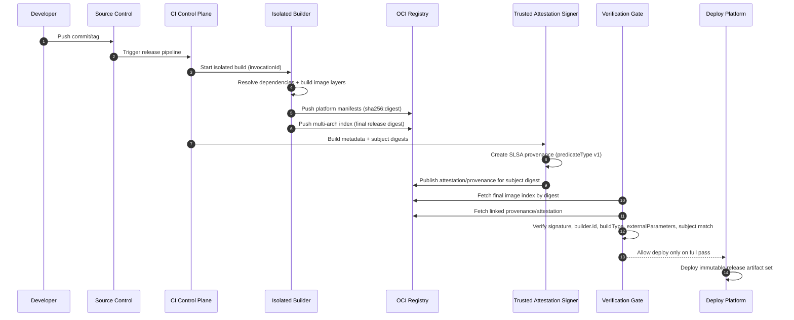

# SLSA Provenance (v1.2) для контейнерных образов: Обзор

## 1. Область и цель

Этот обзор описывает, как применять `SLSA v1.2` к CI/CD-пайплайну, который собирает и публикует контейнерные образы.

Цель:
- обеспечить проверяемую трассировку `source -> build -> image digest`
- снизить риск подмены артефакта, подделки metadata и несанкционированного build-влияния

Трассировка применения SLSA в этом документе:
- сначала фиксируется целевой уровень зрелости пайплайна
- затем задаются обязательные требования к producer/build platform
- затем формализуется модель угроз
- после этого строится референсная CI/CD-модель и разбирается по этапам верификации
- в конце задаются policy-правила и минимальный поэтапный рецепт внедрения

---

## 2. Целевая модель зрелости: L1 -> L2 -> L3

### 2.1 Build L1

- provenance существует и описывает, как собран образ
- польза: видимость и воспроизводимость процесса
- ограничение: низкая устойчивость к подделке

### 2.2 Build L2

- provenance генерирует/подписывает hosted build platform
- верификатор проверяет подпись и identity builder
- baseline для production-цепочки поставки

### 2.3 Build L3

- усиленная защита от подделки provenance tenant-процессом
- изоляция между билдами, эфемерная среда, недоступность signing secrets
- `externalParameters` должны быть полными (без скрытых каналов внешнего влияния на build)
- целевой уровень для большинства production-релизов

---

## 3. Требования к pipeline (producer + build platform)

### 3.1 Контроли source и invocation

- только canonical repo/revision для release-веток
- явная политика допустимых trigger-типов (tag, protected branch)
- запрет неутвержденных runtime-параметров сборки

### 3.2 Контроли build environment

- hosted runner для release builds
- one-build-one-ephemeral-environment
- запрет shared mutable state между concurrent builds
- cache рассматривается как недоверенный input; для release-пайплайна обязательны cache-safe controls (scoped cache keys, provenance-consistent inputs), а для high-risk релизов — optional no-cache rebuild

### 3.3 Контроли артефактов

- публикация и policy decisions только по digest (`sha256:...`), не по mutable tag
- multi-arch: отдельная проверка каждого manifest digest

---

## 4. Модель угроз (обзор)

Основные сценарии, которые должен покрывать pipeline:
- build от неканоничного source (fork/branch/tag drift)
- подмена `externalParameters` для внедрения несанкционированного поведения
- подделка provenance или подписи после сборки
- tampering в registry/транзите
- cross-build влияние (cache poisoning, persistence между билдами)

Минимальная привязка к SLSA-проверкам:
- шаг 1: подлинность provenance + соответствие `subject`
- шаг 2: соответствие ожиданиям (`builder.id`, source, `buildType`, parameters)
- шаг 3: зависимые артефакты (`resolvedDependencies`) по best effort/рекурсивно

---

## 5. Референсная модель CI/CD для container images

### 5.1 Поток поставки

`commit/tag -> CI trigger -> isolated build -> image push (digest) -> provenance generation/signing -> attestation publish -> verification gate -> deploy`

### 5.2 Ключевые trust boundaries

- developer/workstation
- source control system
- build platform control plane
- attestation signer service (часть build platform control plane)
- user-defined build steps (tenant workload)
- registry/distribution layer
- deployment control plane (admission/policy engine)

### 5.3 Sequence-диаграмма: формирование итогового артефакта



### 5.4 Как читать диаграмму: надежные и рискованные пути

Надежный путь (release path):
- trigger из canonical source
- isolated build в trusted build platform
- публикация только digest-артефактов
- trusted attestation signer формирует provenance
- verification gate принимает решение по policy и только затем deploy

Пути повышенного риска (focus points):
- любой неканоничный source/trigger до запуска build
- любые runtime-параметры, не входящие в schema `externalParameters`
- shared state/cache, влияющий на cross-build поведение
- попытка signer access из tenant build steps
- deploy по tag без проверки attestation/provenance

Практическое правило:
- attestation signer относится к trusted build platform control plane; tenant build steps не должны иметь к нему прямого доступа и не должны иметь доступ к signing secrets provenance

### 5.5 Что верифицировать на каждом этапе

- перед build: canonical source/revision + допустимый trigger
- после build: subject digest + provenance envelope authenticity
- перед deploy: `predicateType`, `builder.id`, issuer/identity, `buildType`, `externalParameters` schema, anti-replay
- после deploy: фиксация gate-pass/fail в audit trail

Итоговый release artifact set:
- OCI image index digest (immutable reference)
- platform-specific image manifests/layers
- SLSA provenance attestation, связанная с digest артефакта
- результат verification gate (pass/fail) в audit trail

---

## 6. Дистрибуция attestations/provenance

### 6.1 Где публиковать

Рекомендуемый минимум:
- primary: в том же OCI repository, с явной привязкой к artifact digest через `subject`/referrers
- secondary: дополнительная площадка только как backup/disaster channel (например, release assets)

### 6.2 Связь artifact <-> attestation

- поддерживать one-to-many (несколько attestations на артефакт)
- принимать attestations только если одновременно выполняются два условия: `builder.id` в allowlist и issuer/identity подписи в allowlist
- attestations должны быть immutable: не перезаписывать attestation для того же digest

---

## 7. Корни доверия и закрепление identity

### 7.1 Что фиксировать в policy

- issuer и subject/SAN сертификата подписи (exact match или строго ограниченный regexp для конкретного CI workflow identity)
- `builder.id` (exact match) и максимальный доверенный SLSA Build level для этой пары identity+builder
- trust roots для проверки подписи (например, Fulcio/Rekor или корпоративная PKI), отдельно по средам
- ожидаемый `buildType` и версия policy/schema для `externalParameters`

Минимальная модель policy:

```yaml
trusted_builders:
  - issuer: https://token.actions.githubusercontent.com
    subject: https://github.com/ORG/REPO/.github/workflows/release.yml@refs/tags/v*
    builder_id: https://github.com/slsa-framework/slsa-github-generator/.github/workflows/generator_generic_slsa3.yml@refs/tags/v*
    max_slsa_build_level: 3
    build_type: https://slsa-framework.github.io/github-actions-buildtypes/workflow/v1
    external_parameters_schema: policy://slsa/github-actions/v3
```

### 7.2 Ротация trust roots/identity без outage

- проводить ротацию через controlled overlap: временно принимать old+new identity, затем удалять old
- каждое изменение trust roots/allowlist оформлять как policy change с ревью и audit trail

---

## 8. Политика проверки перед deploy и минимальный рецепт внедрения

### 8.1 Обязательный gate

1. Проверка структуры statement: `_type = https://in-toto.io/Statement/v1` и наличие `subject[]`, `predicate.buildDefinition`, `predicate.runDetails`
2. Проверка аутентичности provenance envelope и соответствия `subject`
3. Проверка `predicateType = https://slsa.dev/provenance/v1`
4. Проверка roots of trust, `builder.id` и issuer/identity подписи по allowlist
5. Проверка expectations по source/build parameters; ключи в `externalParameters`, не входящие в утвержденную schema для конкретного `buildType` и версии policy, => fail
6. Проверка anti-replay условий: `startedOn <= finishedOn`; возраст provenance проверяется через параметр `max_provenance_age`, заданный per environment (например, prod `24h`, staging `7d`)
7. Исключение для delayed deploy/promote: повторный deploy ранее одобренного digest допускается при неизменности digest артефакта, неизменности provenance/attestation digest и наличии валидного предыдущего gate-pass в audit trail

### 8.2 Политика решений

- default: `deny`
- deploy разрешается только при полном pass обязательных проверок
- break-glass допустим только по оформленному exception с TTL и последующим RCA

Ограничение для production:
- `break-glass` для prod не дольше `24h`, с обязательным post-incident review

### 8.3 Минимальный рецепт внедрения (поэтапно)

Если референсная модель недостижима за один шаг, внедрять по фазам:

1. Phase A (L1):
- выпускать digest-only артефакты
- генерировать provenance для каждого release image
- сохранять gate result в audit trail

2. Phase B (L2):
- перенести release builds на hosted runner
- включить проверку подписи provenance + `builder.id` + issuer/identity allowlist
- запретить deploy без полного mandatory gate-pass

3. Phase C (L3):
- обеспечить one-build-one-ephemeral-environment
- закрыть прямой доступ tenant steps к signer/secrets
- зафиксировать schema-versioned policy для `externalParameters` и правила anti-replay per environment
