# Infrastructure Technologies

This document explains how key technologies commonly seen in production infrastructure and security reviews work. It does not replace playbooks: the focus here is purpose, operating model, responsibility boundaries, and common production patterns.

## Docker

### What It Is Used For
Docker is used to build, package, and run applications in containers. In production it most often appears as an image build tool, a local development tool, a CI/CD pipeline component, and part of the container supply chain, even when Kubernetes runs containers through containerd or CRI-O rather than Docker Engine.

### Operating Model
`Dockerfile` describes what an image is built from: the base image, package installation, copied files, environment variables, user, working directory, and startup command. During a build, Docker turns instructions into a set of layers. Each layer records a filesystem change, and the final image becomes a portable artifact that can be pushed to a registry and run in different environments.

A registry stores and serves images. Docker CLI is the client used by developers or CI jobs to send build, publish, and run commands. Docker daemon executes those commands on the host: it builds images, creates containers, attaches volumes and networks, assigns constraints, and delegates low-level execution to the runtime.

A container is a running process with an isolated view of the filesystem, processes, network, and resources. A volume is used for data that must survive container recreation. A network defines how a container communicates with other containers, the host, and external systems.

A typical flow looks like this: a developer or CI job builds an image from a `Dockerfile`, publishes it to a registry, then a runtime pulls the image and starts a container from an immutable set of layers with configured namespaces, cgroups, capabilities, mounts, and networking. When used with Kubernetes, Docker usually remains in the build/package stage, while node-level execution is handled by a container runtime.

### Interaction Diagram
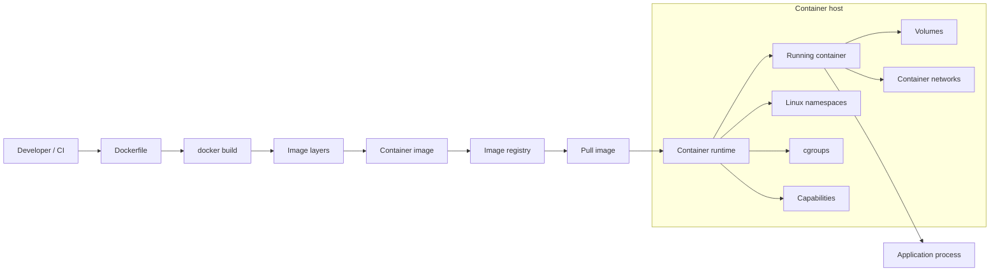

### Responsibility Boundaries
Docker helps package an application and define runtime parameters, but it does not make an image secure automatically. The team is responsible for minimizing the base image, keeping secrets out of layers, pinning versions, scanning dependencies, running without root, limiting capabilities, and publishing images correctly to a registry.

The application still owns its own authentication, authorization, input handling, and safe use of secrets.

### Common Production Patterns
- Building images in CI.
- Storing images in a private registry.
- Multi-stage builds.
- Minimal base images.
- Image scanning before publication or deployment.
- Image signing and provenance for critical services.
- Running containers in Kubernetes through containerd or CRI-O rather than directly through Docker Engine.

### Related Project Files
- `content/kubernetes/container-escape-capability-abuse/overview.ru.md` / `overview.en.md` — container escape risks through capabilities and dangerous container settings.
- `content/kubernetes/pod-security/playbook.ru.md` / `playbook.en.md` — secure workload settings that apply to containers in Kubernetes.
- `content/supply-chain/slsa-provenance/overview.ru.md` / `overview.en.md` — artifact origin, supply chain, and build trust.

## OCI Registry / Artifact Registry

### What It Is Used For
An OCI registry stores and serves container images and related supply-chain artifacts: SBOMs, signatures, provenance attestations, scan results, Helm charts, and other OCI-compatible objects. In production, the registry is usually the central point between the build pipeline, the deployment platform, and runtime: CI publishes artifacts, the admission/deploy gate verifies them, and Kubernetes nodes pull digests to run workloads.

### Operating Model
The OCI Distribution Specification defines the API for pushing and pulling content through a registry. The core objects are blobs, manifests, image indexes, digests, and tags. A blob stores an image layer or config. A manifest describes one image or artifact and references blobs by digest. An image index connects several platform-specific manifests, such as `linux/amd64` and `linux/arm64`. A digest is a content-addressed identifier; a tag is a human-readable reference to a manifest and may be mutable unless registry policy prevents it.

A repository inside a registry groups related artifacts, for example `prod/payments/api`. A client pushes blobs and a manifest, then may assign a tag. During pull, the client asks for a manifest by tag or digest, receives blob digests, and downloads the blobs. Production Kubernetes deployments should reference images by digest because a tag is not a reliable immutable reference without a separate tag immutability policy.

Modern artifact registries often store not only images, but also referrers: signatures, SBOMs, and provenance linked to a subject digest. For example, image `sha256:...` can have a cosign signature, SLSA provenance, and SBOM as separate OCI artifacts. A deploy gate or admission policy first extracts the image digest, then looks for linked attestations/referrers and verifies the signature, builder identity, provenance predicate, and policy outcome.

The registry also handles authorization, retention, replication, vulnerability scanning, pull-through cache, and audit logs. In a cloud registry this is often a managed service with IAM policies; in self-hosted deployments such as Harbor or distribution-based registries, the team owns storage, TLS, auth, replication, and cleanup.

### Interaction Diagram
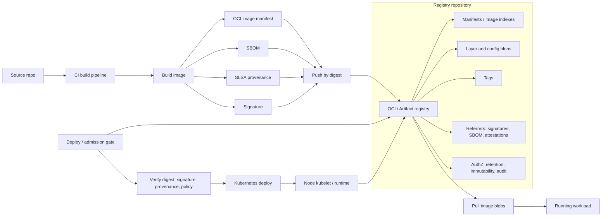

### Responsibility Boundaries
A registry stores and serves artifacts through an API, but it does not automatically prove that an image is safe, signed by the right subject, or built from an approved source. The team owns authentication and authorization, immutable digest-based deployment, tag immutability for release tags, signatures, provenance, retention, vulnerability management, and audit trail.

The artifact registry should not be the only control point. Even if the registry blocks some unsafe images, the deploy gate should independently verify digest, signature, builder identity, provenance, and policy decision before a workload reaches production.

### Common Production Patterns
- Private registry with IAM/RBAC and separate repositories by environment or domain.
- Deployment only by digest (`image@sha256:...`); tags are used for discovery, not as the trust anchor.
- Tag immutability for release tags and no overwrites for production tags.
- Image signing and SBOM/provenance publication as OCI artifacts/referrers.
- Admission/deploy gate that verifies signature, trusted builder identity, SLSA provenance, and vulnerability policy.
- Retention policy for old images while keeping artifacts required for rollback, incident response, and audit.
- Pull-through cache with a separate trust policy for upstream images.
- Audit logging for push/delete/tag mutation/anomalous pull patterns.

### Related Project Files
- `content/supply-chain/slsa-provenance/overview.ru.md` / `overview.en.md` — provenance, verification policy, and trusted builders.
- `content/kubernetes/cluster-security-review/playbook.ru.md` / `playbook.en.md` — registry as part of the deployment chain and production gate.
- `content/kubernetes/adversarial-validation/playbook.ru.md` / `playbook.en.md` — private registry exposure, image history, and supply-chain abuse path checks.
- `content/kubernetes/pod-security/playbook.ru.md` / `playbook.en.md` — runtime impact of running an untrusted image.

## Kubernetes

### What It Is Used For
Kubernetes is used to orchestrate containerized applications: scheduling, service discovery, rollouts, autoscaling, configuration, secrets, networking, and workload lifecycle management. In production it often acts as the base platform for microservices, batch jobs, internal platforms, and cloud-native infrastructure.

### Operating Model
The API Server is the central management point: user commands, controller activity, kubelet communication, and external integrations go through it. It validates requests, applies authentication, authorization, and admission, then stores desired state in etcd. etcd stores cluster state: workload objects, services, secrets, bindings, configuration, and metadata.

The scheduler selects a node for a pod based on resources, constraints, affinity, taints/tolerations, and other placement rules. The controller-manager runs controllers that continuously compare desired state with actual state: for example, creating new pods for a Deployment, replacing failed pods, or synchronizing endpoints for a Service. Admission controllers run at the API boundary and can mutate or reject objects before they are persisted.

On each worker node, kubelet receives assigned pods through the API Server and asks the container runtime to start the required containers. The container runtime pulls images and creates containers. The CNI plugin configures pod networking, while kube-proxy or an eBPF/CNI replacement provides service networking.

A pod is the smallest executable Kubernetes unit: one or more containers with shared network identity and volumes. A Deployment manages stateless replicas and rollouts, a StatefulSet manages stateful workloads with stable identity, and a DaemonSet runs an agent on every suitable node. A Service provides a stable network access point to a dynamic set of pods, while Ingress or Gateway publishes HTTP/TCP entry into the cluster. ConfigMap stores non-secret configuration, Secret stores sensitive values, and ServiceAccount defines workload identity. RBAC connects roles/clusterroles to subjects through rolebindings/clusterrolebindings. NetworkPolicy describes allowed network flows between pods and external addresses.

In a normal flow, a user applies a manifest through the API Server, the object is stored in etcd, a controller creates or updates child objects, the scheduler assigns a pod to a node, kubelet starts containers through the runtime, and networking components make the workload reachable by other services.

### Interaction Diagram
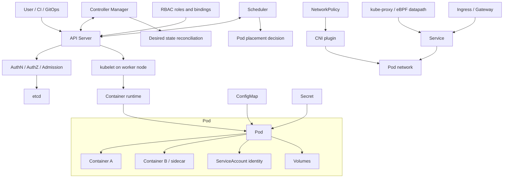

### Responsibility Boundaries
Kubernetes provides APIs and workload management mechanisms, but it does not guarantee secure cluster or application configuration by itself. The platform team owns RBAC, isolation, admission policies, network policies, audit logs, node hardening, upgrade lifecycle, and integration with IAM, secrets, and registries.

Application teams own secure pod specs, health checks, resource limits, secrets, ingress configuration, and application behavior.

### Common Production Patterns
- Managed Kubernetes: EKS, GKE, AKS, or an equivalent platform.
- GitOps through Argo CD or Flux.
- Namespace separation by environment, team, or blast radius.
- Separate node pools for trusted/untrusted, stateful, GPU, or privileged workloads.
- Ingress controller or Gateway API.
- External Secrets Operator or CSI driver for secrets.
- Policy engine: Kyverno or OPA Gatekeeper.
- Private control plane and restricted access to the Kubernetes API.

### Related Project Files
- `content/kubernetes/cluster-security-review/playbook.ru.md` / `playbook.en.md` — comprehensive Kubernetes cluster security review.
- `content/kubernetes/pod-security/playbook.ru.md` / `playbook.en.md` — requirements for secure pod/workload configuration.
- `content/kubernetes/seccomp/checklist.ru.md` / `checklist.en.md` — seccomp profile review.
- `content/kubernetes/container-escape-capability-abuse/overview.ru.md` / `overview.en.md` — container escape and Linux capability misuse.

## CNI / Kubernetes Networking

### What It Is Used For
CNI and Kubernetes networking provide pod connectivity, service discovery, Service load balancing, egress/ingress paths, and network policy enforcement. In production this is one of the main blast-radius control layers: the CNI decides whether a workload in one namespace can reach another workload, a metadata endpoint, a control-plane endpoint, or an external system.

Common implementations include Cilium, Calico, cloud-provider CNIs, Flannel, and other plugins. Cilium focuses on an eBPF datapath, observability, and kube-proxy replacement. Calico is widely used for Kubernetes NetworkPolicy and extended policy models, including GlobalNetworkPolicy in the Calico stack. Some managed clusters use cloud-native CNI where pod IPs integrate directly with the VPC/VNet.

### Operating Model
Kubernetes defines the general network model: a pod gets an IP, pods can communicate with each other, a Service provides a stable virtual IP or DNS name for a set of endpoints, and NetworkPolicy describes allowed ingress/egress flows. The Kubernetes API stores objects, but it does not enforce NetworkPolicy on the datapath. Enforcement is performed by the CNI plugin or an associated policy engine.

The CNI plugin is called by kubelet/container runtime when a pod sandbox is created. It allocates an IP, connects the pod network interface, programs routes, rules, eBPF maps, or iptables/nftables, and then maintains state as pods, nodes, services, and policies change. DNS is usually provided by CoreDNS, while Service traffic is implemented by kube-proxy through iptables/IPVS or by the CNI datapath when kube-proxy replacement is used.

NetworkPolicy is a namespace-scoped Kubernetes resource. It selects pods through labels and defines which ingress and egress traffic is allowed. The important semantic detail: a pod without a matching policy is usually non-isolated for that direction. Once a pod is selected by an ingress or egress policy, only explicitly described flows are allowed for that direction. This means default deny requires a dedicated policy, not just the presence of a CNI.

Cilium can replace kube-proxy and implement Service load balancing through eBPF. In that model, Cilium agents program the eBPF datapath on nodes, use maps for service/backend lookup, collect flow visibility through Hubble, and enforce L3/L4/L7 policies. Calico can enforce Kubernetes NetworkPolicy and its own extended policies, including ordered rules, tiers, and host endpoints depending on edition/configuration. The practical review point: check not only policy YAML, but also the actual CNI, datapath mode, egress support, namespace selectors, DNS/FQDN policies, and observability.

### Interaction Diagram
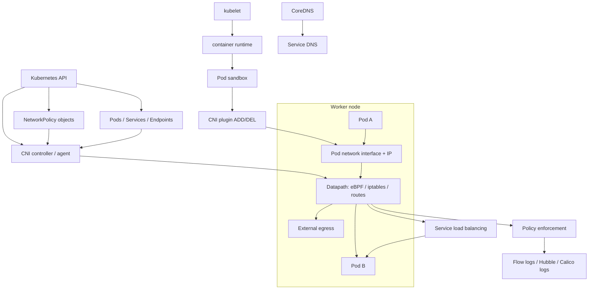

### Responsibility Boundaries
CNI provides the datapath and may enforce NetworkPolicy, but it does not know service business semantics. The platform owns CNI selection, policy enforcement enablement, default-deny baseline, egress strategy, observability, upgrade compatibility, and validation that policy is actually active.

Application teams own correct labels, required service-to-service flow definitions, avoiding implicit "namespace isolation" assumptions, and connectivity testing after changes.

### Common Production Patterns
- Default-deny ingress and egress for production/high-value namespaces.
- Explicit allow rules for service-to-service flows, DNS, and required egress.
- Separate node pools or clusters for workloads with different trust levels.
- Cilium/Hubble or Calico flow logs for network event investigation.
- Kube-proxy replacement only after compatibility checks with cloud load balancers, service mesh, NodePort/LoadBalancer behavior, and observability.
- Egress gateway/NAT strategy for stable outbound traffic identity.
- NetworkPolicy re-test after changes to namespace labels, pod labels, CNI version, and service selectors.
- Separate controls for metadata endpoints and cloud control-plane endpoints.

### Related Project Files
- `content/kubernetes/cluster-security-review/playbook.ru.md` / `playbook.en.md` — service boundary review, egress, and NetworkPolicy baseline.
- `content/kubernetes/adversarial-validation/playbook.ru.md` / `playbook.en.md` — namespace bypass, SSRF, NodePort exposure, and actual reachability checks.
- `content/kubernetes/pod-security/playbook.ru.md` / `playbook.en.md` — pod-level controls complement, but do not replace, network isolation.
- `content/architecture/security-review/checklist.ru.md` / `checklist.en.md` — trust boundary and data flow analysis.

## Ingress / Gateway / API Gateway

### What It Is Used For
Ingress, Gateway, and API Gateway publish services outside the cluster or between network zones. They accept client traffic, terminate TLS or pass TLS through, route requests to Kubernetes Services, apply authentication/authorization integrations, rate limits, WAF/API security policies, header normalization, and observability.

Production implementations include NGINX Ingress Controller, cloud load balancer controllers, Envoy Gateway, Kong Gateway/Kong Ingress Controller, HAProxy/Contour/Traefik, and service mesh gateway components. Kubernetes Ingress remains a stable API for HTTP/HTTPS routing, but its development is frozen; new Kubernetes networking capabilities are primarily developed in Gateway API. If the controller is implemented by Istio, this section describes the north-south entry point, while Istio mesh semantics (`VirtualService`, `DestinationRule`, `PeerAuthentication`, `AuthorizationPolicy`, sidecar/ambient) are covered separately in the Istio section.

### Operating Model
An Ingress resource describes host/path routing to a backend Service. By itself, Ingress does not work without an Ingress Controller. The controller watches the Kubernetes API, selects Ingress objects by `ingressClassName`, generates proxy/load balancer configuration, and exposes an external endpoint through a `LoadBalancer` Service, NodePort, cloud load balancer, or edge appliance.

Gateway API separates roles more explicitly. `GatewayClass` describes the controller type. `Gateway` describes listeners, addresses, ports, TLS, and rules for which Routes may attach to it. `HTTPRoute`, `GRPCRoute`, `TCPRoute`, `TLSRoute`, and other route resources describe application-level routing. `allowedRoutes` and the cross-namespace attachment model form a trust boundary between the platform team that owns the Gateway and application teams that own Routes. Do not confuse Kubernetes Gateway API `Gateway` with Istio `networking.istio.io/Gateway`: the names are similar, but ownership, deployment model, and route resources differ.

An API Gateway adds API-management functions: plugins/policies for auth, JWT/OIDC validation, API keys, rate limiting, request/response transformation, WAF, bot protection, schema validation, developer portals, or analytics. In Kubernetes this can be the same controller that reads Ingress/Gateway API resources and generates gateway data plane configuration.

Critical security review points: where TLS terminates, whether `X-Forwarded-*` is trusted, who can create routes for public hostnames, how wildcard hosts are protected, whether upstream mTLS exists, how authentication is enforced, how WAF/rate limiting works, who can change annotations/plugins, and whether they bypass the baseline.

### Interaction Diagram
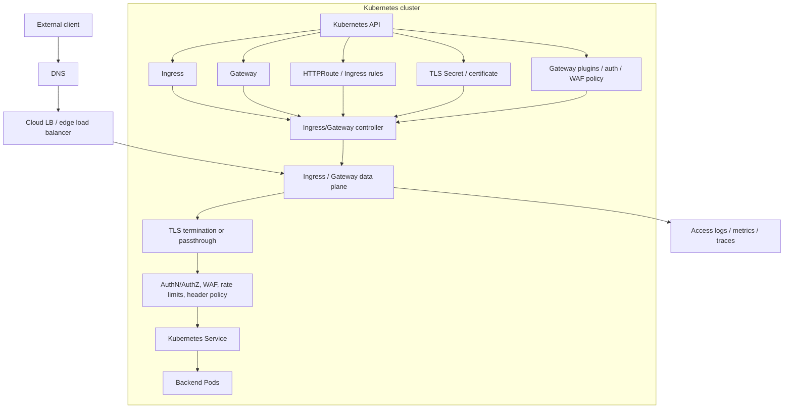

### Responsibility Boundaries
The Ingress/Gateway layer controls the network entry point, but it does not replace application authorization. If the gateway only checks token presence, the application still needs to enforce business authorization and tenant boundaries. If TLS terminates at the gateway, decide explicitly whether mTLS or encryption is required to the upstream service.

The platform owns controller hardening, class ownership, public exposure, certificate lifecycle, baseline annotations/plugins, default security headers, logging, and guardrails for cross-namespace routes. Application teams own route ownership, backend readiness, correct host/path rules, and application compatibility with proxy headers/timeouts.

### Common Production Patterns
- Gateway API for new deployments, Ingress for existing workloads where migration is not complete.
- Separate ingress/gateway classes for public, internal, and admin traffic.
- TLS termination at the gateway with managed certificate lifecycle; upstream mTLS for sensitive backends.
- Strict policy for `X-Forwarded-*`, `Forwarded`, `Host`, and client IP headers; applications trust only headers from approved proxies.
- WAF/API security and rate limiting on public routes.
- Wildcard hosts denied or separately approved.
- Cross-namespace route attachment only through explicit `allowedRoutes`/ReferenceGrant and ownership rules.
- Access logs with correlation ID, request outcome, upstream service, and policy decision.
- Controller service account protection: it can often read Secrets and change gateway/proxy configuration.

### Related Project Files
- `content/kubernetes/cluster-security-review/playbook.ru.md` / `playbook.en.md` — entry point inventory, service exposure, and ownership.
- `content/kubernetes/adversarial-validation/playbook.ru.md` / `playbook.en.md` — NodePort/Ingress/Gateway reachability and SSRF/internal exposure checks.
- `content/web/owasp-top-10/playbook.ru.md` / `playbook.en.md` — application-layer risks behind the gateway.
- `content/architecture/security-review/checklist.ru.md` / `checklist.en.md` — trust boundaries, external integrations, and architectural review evidence.

## Container Runtimes

### What It Is Used For
A container runtime starts containers on a node: it pulls images, prepares the filesystem, namespaces, and cgroups, and hands execution to a lower-level runtime. In Kubernetes, the runtime usually works through CRI and is part of every worker node.

### Operating Model
CRI is the interface between kubelet and the runtime. Because of CRI, kubelet is not tied to a specific implementation and can work with containerd, CRI-O, or another compatible runtime. The runtime receives kubelet requests to create a pod sandbox, pull an image, start a container, stop a container, and report status.

The OCI image spec defines the image format, while the OCI runtime spec defines how to start a container from that image with the required namespaces, cgroups, mounts, capabilities, and entrypoint process. The image store keeps pulled images locally on the node. The snapshotter prepares filesystem layers so a container gets its working filesystem view without copying the whole image.

A pod sandbox represents the infrastructure shell of a pod: networking, namespaces, and base resources inside which application containers run. A shim process maintains the connection to a running container and lets the runtime avoid keeping the entire lifecycle inside one process.

A typical chain looks like this: kubelet receives a pod assignment, calls the CRI runtime, the runtime pulls the image from a registry, prepares snapshots/layers, creates a sandbox, and then invokes an OCI runtime such as `runc` or Kata Containers. The low-level runtime creates Linux isolation and starts the application process.

### Interaction Diagram
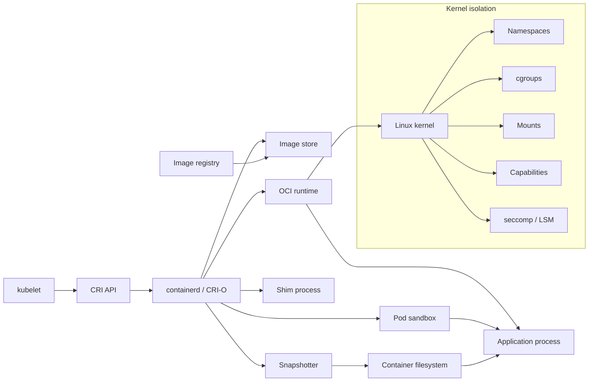

### Responsibility Boundaries
The runtime executes a container with the requested constraints, but it does not decide which permissions are safe. If a Kubernetes workload requests privileged mode, dangerous capabilities, `hostPath`, `hostPID`, or `hostNetwork`, the runtime will technically apply that configuration.

Policy, admission control, and baselines belong to the platform.

### Common Production Patterns
- containerd as the runtime in managed Kubernetes.
- CRI-O in clusters oriented around a Kubernetes-native runtime stack.
- RuntimeClass for isolating selected workloads.
- gVisor or Kata Containers for workloads with stronger isolation requirements.
- Centralized runtime configuration in node images.
- Runtime event monitoring and node-level audit.

### Related Project Files
- `content/kubernetes/container-escape-capability-abuse/overview.ru.md` / `overview.en.md` — the connection between runtime isolation, capabilities, and escape scenarios.
- `content/kubernetes/pod-security/playbook.ru.md` / `playbook.en.md` — workload settings that the runtime applies on the node.
- `content/kubernetes/seccomp/checklist.ru.md` / `checklist.en.md` — syscall filtering as part of runtime hardening.

## Istio

### What It Is Used For
Istio is used as a service mesh for service-to-service traffic management: mTLS, traffic routing, retries, telemetry, authorization policies, and progressive delivery. In production it most often appears in Kubernetes clusters with many internal services and strict service-to-service security requirements.

### Operating Model
Istiod is the mesh control plane. It consumes Kubernetes/Istio configuration, generates and distributes data plane configuration, manages service discovery, and participates in certificate distribution for mTLS. The data plane is represented by an Envoy proxy next to the application in the sidecar model, or by ambient mesh components when ambient mode is used. In ambient mode, the base L4 secure overlay is provided by per-node `ztunnel`, while L7 features are added through waypoint proxies.

Envoy proxy intercepts inbound and outbound workload traffic, establishes mTLS, applies routing rules, retry/timeout policy, authorization policy, and collects telemetry. An ingress gateway accepts external traffic into the mesh, while an egress gateway centralizes controlled outbound traffic from the mesh to external systems.

Key CRDs define mesh behavior. In the Istio API, `VirtualService` describes routing and traffic shifting. `DestinationRule` defines subsets, load balancing, and connection policy for an upstream. `Gateway` controls ingress/egress points into the mesh. `PeerAuthentication` defines the mTLS mode, and `AuthorizationPolicy` defines which workload may call which other workload. Separately, Istio supports Kubernetes Gateway API; in that model, `Gateway`, `HTTPRoute`, and other route resources come from `gateway.networking.k8s.io`, not from the Istio API.

When combined with Kubernetes, the application remains a regular Deployment/Pod, but its traffic passes through the data plane. Istiod watches services and policies in the Kubernetes API, recalculates configuration, and sends it to proxies. Proxies on the traffic path then enforce mTLS, routing, policy, and telemetry without changing application business code.

### Interaction Diagram
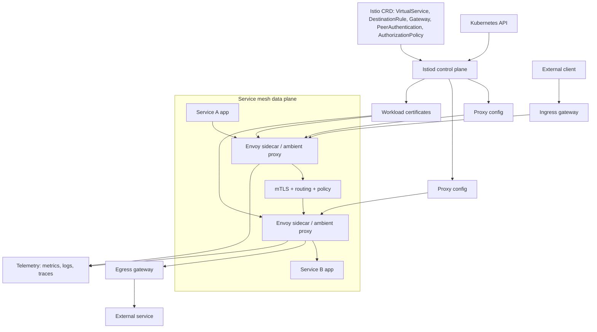

### Responsibility Boundaries
Istio can provide mTLS between workloads and centralized mesh policy, but it does not fix weak application authentication and does not replace Kubernetes RBAC, NetworkPolicy, CNI datapath policy, or API security. NetworkPolicy is still needed for L3/L4 blast-radius control and for limiting traffic that should not rely only on mesh enrollment.

The platform owns correct mesh onboarding, certificate lifecycle, policy model, gateway exposure, and compatibility with applications.

### Common Production Patterns
- Mesh enabled only for selected namespaces instead of the whole cluster at once.
- Strict mTLS for internal services.
- AuthorizationPolicy for service-to-service access.
- Separate ingress and egress gateways when north-south or outbound traffic must pass through controlled mesh edge points.
- Explicit decision on which API owns routing: Istio `VirtualService`/`Gateway`, Kubernetes Gateway API, or both during a transition.
- Canary/blue-green routing through VirtualService and DestinationRule.
- Telemetry integration with Prometheus, Grafana, or OpenTelemetry.
- Gradual migration from sidecar to ambient mesh where justified.

### Related Project Files
- `content/kubernetes/cluster-security-review/playbook.ru.md` / `playbook.en.md` — applies to mesh as part of the Kubernetes control/data plane.
- `content/kubernetes/pod-security/playbook.ru.md` / `playbook.en.md` — sidecar/mesh workloads remain Kubernetes workloads and inherit pod security requirements.
- `content/architecture/security-review/checklist.ru.md` / `checklist.en.md` — useful for analyzing trust boundaries and service-to-service communication.
- There is no dedicated Istio playbook yet.

## Vault

### What It Is Used For
HashiCorp Vault is used for centralized secret management, dynamic credentials, encryption-as-a-service, and access to sensitive material. In production it often sits between applications, CI/CD, Kubernetes, and external systems such as databases, cloud IAM, PKI, SSH, and message brokers.

### Operating Model
Vault server receives API requests, performs authentication, checks policy, calls secret engines, and writes audit events. The storage backend stores encrypted Vault state: configuration, metadata, policies, and secret engine data. Seal/unseal protects master key material: while Vault is sealed, it cannot decrypt storage or serve normal requests.

Auth methods connect an external identity to a Vault identity: Kubernetes service account, OIDC subject, AppRole, cloud IAM principal, or another source. A policy defines which paths and operations are available. A token is the result of authentication and carries a set of policies. A lease defines the lifetime of an issued secret or credential and lets Vault renew or revoke it.

Secret engines perform the actual work. KV stores static secrets. The database engine issues dynamic database credentials. The PKI engine issues certificates. The Transit engine performs cryptographic operations without exposing key material to the client. Audit devices record requests and responses in audit logs with sensitive values masked.

A normal flow is: a workload authenticates through an auth method, receives a token with a limited policy, calls a secret engine path, and Vault returns a secret, dynamic credential, or cryptographic result. If the secret is leased, Vault tracks its lifetime and can renew or revoke it.

### Interaction Diagram
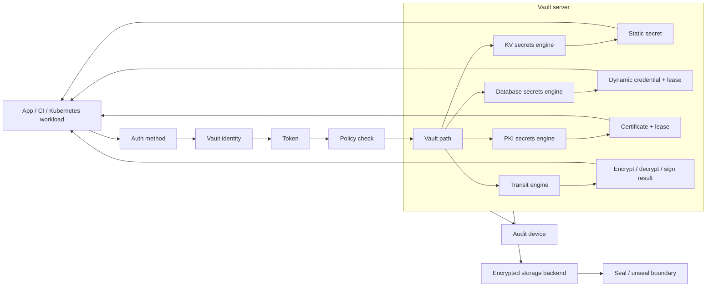

### Responsibility Boundaries
Vault protects secret issuance and lifecycle, but it does not make every application that receives those secrets safe. Teams are responsible for minimal policies, short TTLs, audit logs, rotation, safe secret delivery into runtime, protection of root/admin tokens, and avoiding long-lived static secrets where dynamic ones are possible.

### Common Production Patterns
- HA Vault cluster.
- Auto-unseal through cloud KMS or HSM.
- Kubernetes auth method for workloads.
- Dynamic database credentials.
- PKI engine for internal certificates.
- External Secrets Operator or Vault Agent Injector.
- Centralized audit devices.
- Separation of namespace, mount, and policy by team and environment.

### Related Project Files
- `content/secrets/vault/playbook.ru.md` / `playbook.en.md` — the main Vault playbook covering policies, auth methods, audit, and operational hardening.
- `content/kubernetes/cluster-security-review/playbook.ru.md` / `playbook.en.md` — relevant when Vault is integrated with Kubernetes auth or secret delivery.
- `content/architecture/security-review/checklist.ru.md` / `checklist.en.md` — useful for analyzing trust boundaries around secrets.

## Ansible

### What It Is Used For
Ansible is used for configuration management, provisioning, infrastructure automation, and orchestration of changes across servers, network devices, and platforms. In production it often appears in bootstrap processes, hardening, patch management, middleware configuration, and operational runbooks.

### Operating Model
Inventory describes managed nodes and groups them by environment, role, or other attributes. A playbook defines a sequence of plays: which hosts to target, which variables to use, which tasks to run, and which privilege escalation settings apply. A task calls a module, and a module performs a concrete action: installing a package, changing a file, managing a service, creating a user, or calling an API.

A role packages reusable tasks, handlers, templates, defaults, and files. Variables parameterize playbook and role behavior for different environments. Facts are data collected from the managed node, such as OS, network interfaces, mounts, and package state. Collections provide modules, plugins, and roles as distributable packages. Ansible Vault encrypts sensitive variables or files when secrets are stored near playbooks.

A control node runs a playbook against managed nodes, usually over SSH or WinRM. Ansible copies or invokes a module on the target system, collects the result, and moves to the next task. Handlers run when changes occur, for example restarting a service after configuration changes.

In infrastructure workflows, Ansible often prepares hosts before they join Kubernetes, Kafka, RabbitMQ, or Vault: it installs packages, lays down configuration, manages service units, and applies baseline hardening.

### Interaction Diagram
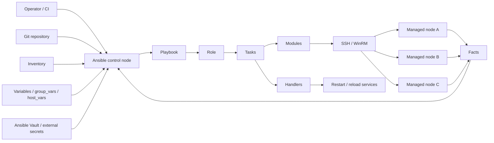

### Responsibility Boundaries
Ansible applies the described changes, but it does not guarantee that a playbook is safe. The team owns access control to the control node, secrets in inventory/vars, change review, idempotency, blast radius limits, safe privilege escalation settings, and reproducible runs.

A mistake in a playbook can propagate insecure configuration at scale.

### Common Production Patterns
- Git-hosted playbooks with review.
- Inventory separation by environment.
- Ansible Vault or an external secrets manager for sensitive variables.
- Execution through AWX/Automation Controller or CI with an audit trail.
- Restricted `become` and SSH access.
- Dry-run/check mode for risky changes.
- Roles for baseline hardening and patch management.

### Related Project Files
- `content/architecture/security-review/checklist.ru.md` / `checklist.en.md` — applies to change management, privileged automation, and trust boundaries.
- `content/secrets/vault/playbook.ru.md` / `playbook.en.md` — relevant when Ansible retrieves secrets from Vault or stores sensitive variables.
- There is no dedicated Ansible playbook yet.

## Helm

### What It Is Used For
Helm is used as a package manager for Kubernetes: manifest templating, release management, and application distribution through charts. In production it is often used to install platform components, ingress controllers, monitoring stacks, policy engines, and internal applications.

### Operating Model
A chart is a package of Kubernetes manifests and templates for one application or platform component. A template contains Kubernetes YAML with Go templating. `values.yaml` and environment-specific values provide render parameters: image tag, replicas, resources, ingress, service account, RBAC, security context, and other settings.

A release is an installed instance of a chart in a specific namespace with a specific set of values. A repository stores charts and chart versions. A dependency allows a chart to include other charts, such as a database or sidecar component. A hook runs Kubernetes resources at specific lifecycle points, such as before install, after upgrade, or before deletion.

Helm renders manifests from templates and values, then sends the resulting Kubernetes objects to the cluster API. Release state is stored in Kubernetes, and updates are performed with `helm upgrade`: Helm compares the new chart/values with the current release and applies changes.

When used with GitOps, Helm is often not run manually by an operator. A GitOps controller takes a chart and values from Git or a registry, renders them or delegates rendering to Helm, then synchronizes the resulting objects with Kubernetes.

### Interaction Diagram
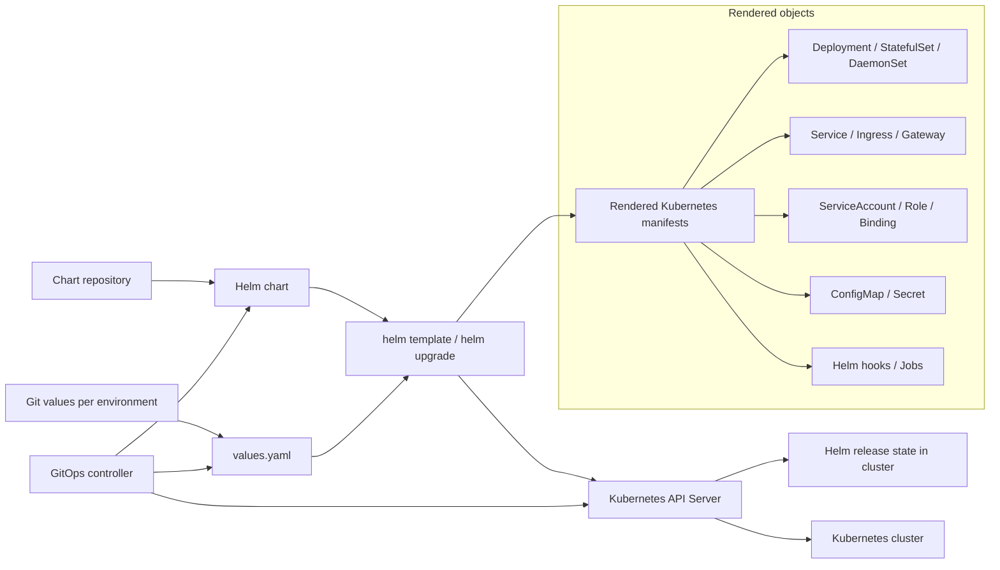

### Responsibility Boundaries
Helm does not determine whether the resulting configuration is secure. A chart can create privileged workloads, wildcard RBAC, unsafe ingress, or secrets with sensitive values.

The team is responsible for reviewing rendered manifests, controlling values, verifying chart provenance, pinning versions, limiting hooks, and checking the permissions that the chart creates in the cluster.

### Common Production Patterns
- Internal chart repository.
- Pinning chart/app versions.
- Separate values per environment.
- Rendering manifests in CI with policy checks.
- A GitOps controller applies the chart instead of manual `helm install`.
- Signature/provenance checks for third-party charts.
- Minimizing post-install hooks and privileged jobs.

### Related Project Files
- `content/kubernetes/cluster-security-review/playbook.ru.md` / `playbook.en.md` — Helm is often a source of RBAC, workload, and ingress configuration for review.
- `content/kubernetes/pod-security/playbook.ru.md` / `playbook.en.md` — review of final pod specs after chart rendering.
- `content/supply-chain/slsa-provenance/overview.ru.md` / `overview.en.md` — trust in artifacts, including charts and deployment packages.

## Kafka

### What It Is Used For
Apache Kafka is used as a distributed event streaming platform: event bus, ingestion pipeline, audit/event log, integration backbone, stream processing source, and buffer between services. In production Kafka is often a critical shared platform that carries business events, telemetry, and integrations.

### Operating Model
A broker stores topic partition data and serves producers/consumers. A topic is a logical category of events, such as `orders.created`. A partition is an ordered append-only log inside a topic; partitions provide scaling and parallelism. A replica is a copy of a partition on another broker for fault tolerance. The controller manages cluster metadata, partition leader election, and state changes.

A producer publishes records to a topic, selecting a partition explicitly or through a partitioner. A consumer reads records from partitions and advances an offset, which is the read position. A consumer group lets several instances of the same application divide partitions among themselves: one partition within a group is read by only one consumer instance at a time. This provides horizontal scaling for processing.

Schema Registry stores event schemas and helps control compatibility between producer and consumer contracts. Kafka Connect runs connectors that integrate Kafka with databases, object storage, search engines, and other systems. ACLs define who may read, write, create, or administer topics, groups, and cluster resources.

Modern clusters can run in KRaft mode without ZooKeeper. In a working flow, a producer sends an event to the broker leader for a partition, the broker writes it to the log and replicates it to followers, a consumer group reads events and commits offsets, and downstream services use those events for processing, integration, or analytics.

### Interaction Diagram
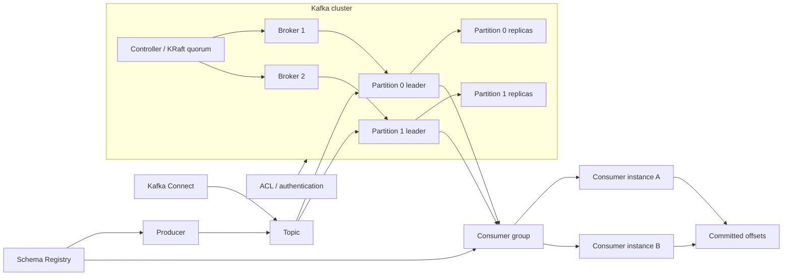

### Responsibility Boundaries
Kafka provides event delivery, storage, and replication, but it does not define data access semantics for the application. Teams are responsible for topic ownership, ACLs, tenant isolation, encryption in transit, retention, schema governance, protecting PII/secrets in events, and handling redelivery correctly.

Kafka does not guarantee that a consumer interprets a message safely.

### Common Production Patterns
- Managed Kafka or a dedicated platform cluster.
- TLS for client-broker and inter-broker traffic.
- SASL, OAuth, or mTLS for authentication.
- ACLs by topic and group.
- Schema Registry for contracts.
- Separate clusters or prefixes for environments and domains.
- Kafka Connect with a separate secret model.
- Monitoring lag, under-replicated partitions, auth failures, and retention pressure.

### Related Project Files
- `content/architecture/security-review/checklist.ru.md` / `checklist.en.md` — applies to event-driven architecture, trust boundaries, and data flow review.
- `content/secrets/vault/playbook.ru.md` / `playbook.en.md` — relevant when credentials, certificates, or connector secrets are issued through Vault.
- There is no dedicated Kafka playbook yet.

## RabbitMQ

### What It Is Used For
RabbitMQ is used as a message broker for queues, routing, asynchronous processing, task distribution, and service integration. In production it often appears in background jobs, transactional messaging, integration queues, and systems where routing semantics, acknowledgements, and backpressure matter.

### Operating Model
A broker accepts messages, stores queues, and delivers messages to consumers. A virtual host separates a logical RabbitMQ space: exchanges, queues, bindings, user permissions, and policies live inside a vhost. An exchange accepts publications from producers and decides which queues should receive a message. A queue stores messages until a consumer reads them. A binding connects an exchange and a queue with a routing rule.

A routing key is used by an exchange to select matching bindings. A direct exchange routes by exact routing key, a topic exchange by patterns, a fanout exchange to all bound queues, and a headers exchange by message headers. A consumer reads a message from a queue and sends an acknowledgement after successful processing. If an acknowledgement is not received, the broker can return the message to the queue or send it through a dead-letter topology, depending on configuration.

A policy defines queue and exchange behavior: TTL, max length, dead-letter exchange, quorum settings, and other parameters. User/permission defines which operations are allowed inside a vhost: configure, write, and read.

The working flow is: a producer publishes a message to an exchange, the exchange uses routing key and bindings to select a queue, the broker stores the message, a consumer takes it and acknowledges processing. If processing fails or the message expires, DLX/retry topology decides whether it is retried, delayed, or sent to a dead-letter queue.

### Interaction Diagram
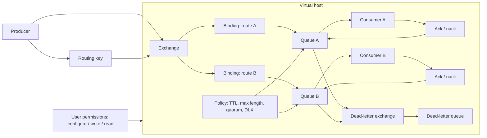

### Responsibility Boundaries
RabbitMQ owns broker delivery and routing, but not message content security or business processing semantics. The team owns TLS, users/permissions, vhost isolation, queue policies, DLQ, TTL, management UI exposure, credential protection, and payload control, especially when messages contain personal data or commands for internal systems.

### Common Production Patterns
- Clustered RabbitMQ with quorum queues for critical queues.
- Separate vhosts for domains, environments, or teams.
- TLS for client connections.
- Least-privilege permissions on exchanges and queues.
- DLQ and retry topology.
- Policies for TTL, max length, and quorum settings.
- Restricted access to the management UI.
- Monitoring queue depth, consumer count, unacked messages, and publish/ack rates.

### Related Project Files
- `content/architecture/security-review/checklist.ru.md` / `checklist.en.md` — applies to asynchronous flows, trust boundaries, and message processing.
- `content/secrets/vault/playbook.ru.md` / `playbook.en.md` — relevant when broker credentials or TLS materials are managed through Vault.
- There is no dedicated RabbitMQ playbook yet.
