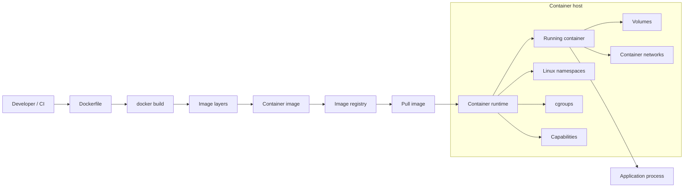
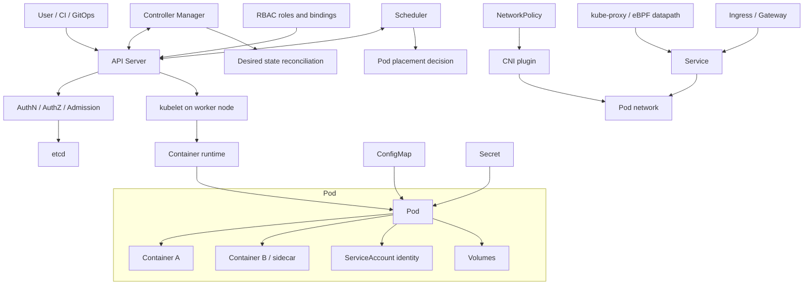
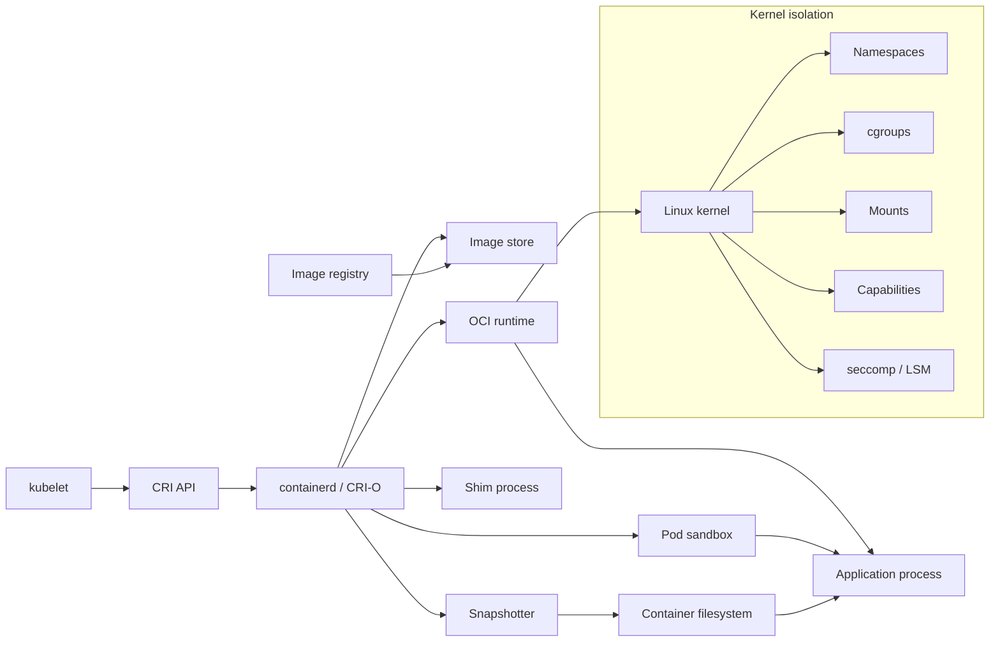
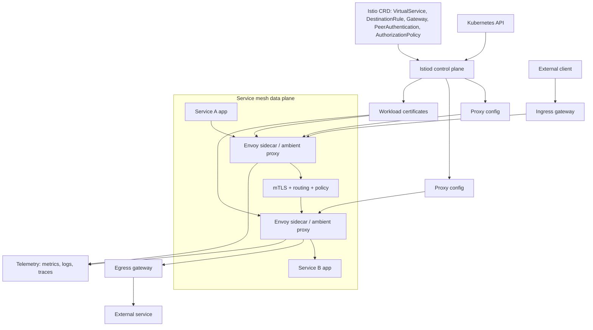
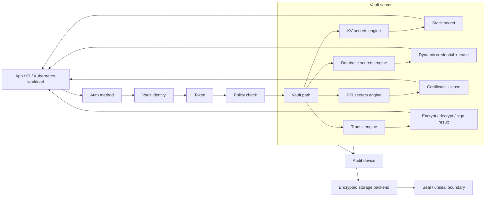
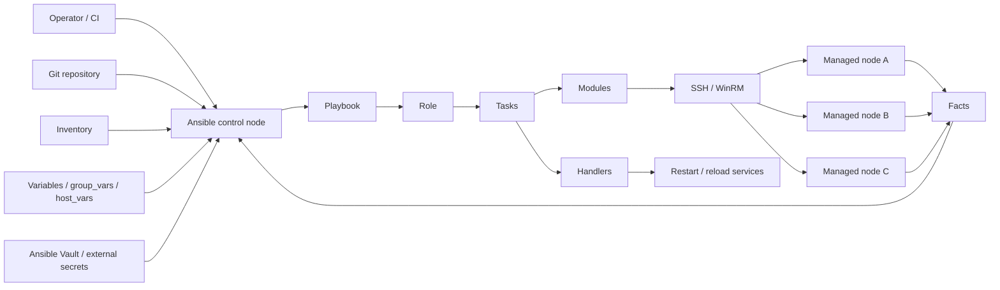
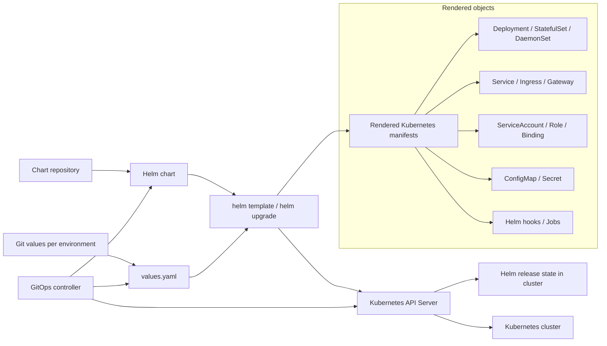
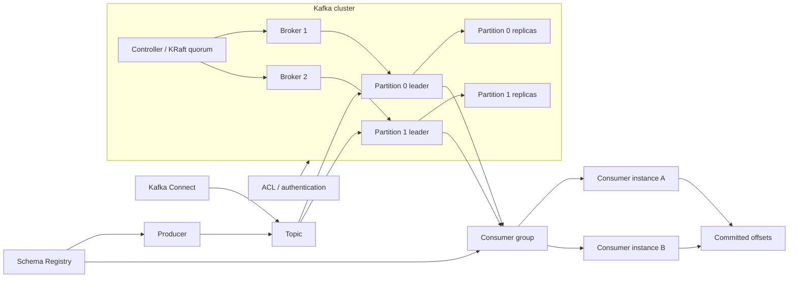
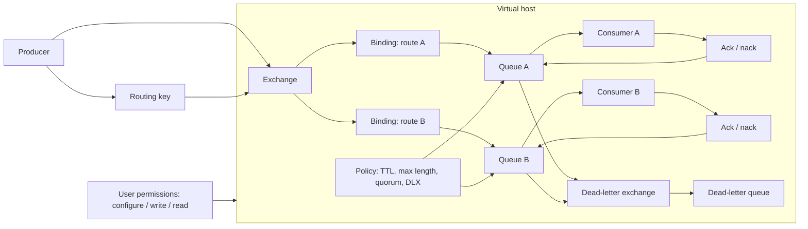

# Infrastructure Technologies

Этот документ описывает, как работают ключевые технологии, которые часто встречаются в production-инфраструктуре и security review. Он не заменяет плейбуки: здесь фокус на назначении, модели работы, границах ответственности и типовых эксплуатационных паттернах.

## Docker

### Для чего используется
Docker используется для сборки, упаковки и запуска приложений в контейнерах. В production он чаще всего встречается как инструмент сборки образов, локальной разработки, CI/CD pipeline и часть контейнерной supply chain, даже если в Kubernetes контейнеры запускает уже containerd или CRI-O.

### Модель работы
`Dockerfile` описывает, из чего собирается образ: базовый image, установку пакетов, копирование файлов, переменные окружения, пользователя, рабочую директорию и команду запуска. При сборке Docker превращает инструкции в набор слоев. Каждый layer фиксирует изменение filesystem, а итоговый image становится переносимым артефактом, который можно положить в registry и запускать в разных окружениях.

Registry хранит и раздает images. Docker CLI является клиентом, через который разработчик или CI отправляет команды сборки, публикации и запуска. Docker daemon выполняет эти команды на host: собирает image, создает container, подключает volumes и networks, назначает ограничения и передает низкоуровневый запуск runtime.

Container — это запущенный процесс с изолированным представлением filesystem, процессов, сети и ресурсов. Volume нужен для данных, которые должны пережить пересоздание container. Network определяет, как container общается с другими container, host и внешними системами.

Обычный поток выглядит так: разработчик или CI собирает image из `Dockerfile`, публикует его в registry, затем runtime скачивает image и запускает container из неизменяемого набора слоев с заданными namespace, cgroups, capabilities, mounts и сетевой конфигурацией. В связке с Kubernetes Docker чаще остается на этапе build/package, а запуском на node занимается container runtime.

### Схема взаимодействия

### Границы ответственности
Docker помогает упаковать приложение и задать параметры запуска, но не делает образ безопасным автоматически. Команда отвечает за минимизацию базового образа, отсутствие секретов в слоях, pinning версий, сканирование зависимостей, запуск без root, ограничение capabilities и корректную публикацию в registry.

Приложение по-прежнему отвечает за собственную аутентификацию, авторизацию, обработку входных данных и безопасную работу с секретами.

### Типовые production-паттерны
- Сборка образов в CI.
- Хранение образов в private registry.
- Multi-stage builds.
- Минимальные base images.
- Image scanning перед публикацией или deployment.
- Подписание образов и provenance для критичных сервисов.
- Запуск контейнеров в Kubernetes через containerd или CRI-O, а не напрямую через Docker Engine.

### Связанные файлы из проекта
- `content/kubernetes/container-escape-capability-abuse/overview.ru.md` / `overview.en.md` — риски container escape через capabilities и опасные параметры контейнера.
- `content/kubernetes/pod-security/playbook.ru.md` / `playbook.en.md` — безопасные настройки workload, применимые к контейнерам в Kubernetes.
- `content/supply-chain/slsa-provenance/overview.ru.md` / `overview.en.md` — происхождение артефактов, supply chain и доверие к сборкам.

## Kubernetes

### Для чего используется
Kubernetes используется для оркестрации контейнеризированных приложений: scheduling, service discovery, rollout, autoscaling, конфигурация, секреты, сетевое взаимодействие и управление жизненным циклом workload. В production он часто является базовой платформой для микросервисов, batch-задач, internal platforms и cloud-native инфраструктуры.

### Модель работы
API Server является центральной точкой управления: через него проходят команды пользователей, контроллеров, kubelet и внешних интеграций. Он валидирует запросы, применяет authentication/authorization/admission и сохраняет желаемое состояние в etcd. etcd хранит состояние кластера: объекты workload, services, secrets, bindings, конфигурацию и метаданные.

Scheduler выбирает node для pod на основе ресурсов, constraints, affinity, taints/tolerations и других правил размещения. Controller-manager запускает контроллеры, которые постоянно сравнивают желаемое состояние с фактическим: например, создают новые pods для Deployment, заменяют упавшие pods или синхронизируют endpoints для Service. Admission controllers работают на входе в API и могут изменять или отклонять объекты до сохранения.

На каждой worker node kubelet получает назначенные pods через API Server и просит container runtime запустить нужные containers. Container runtime скачивает images и создает containers. CNI plugin настраивает сетевую связность pod, а kube-proxy или eBPF/CNI-замена обеспечивает service networking.

Pod — минимальная исполняемая единица Kubernetes: один или несколько containers с общей сетевой identity и volumes. Deployment управляет stateless replicas и rollout, StatefulSet — stateful workload со стабильной identity, DaemonSet — agent на каждой подходящей node. Service дает стабильную сетевую точку доступа к динамическому набору pods, Ingress или Gateway публикует HTTP/TCP-вход в кластер. ConfigMap хранит несекретную конфигурацию, Secret — чувствительные значения, ServiceAccount задает identity workload. RBAC связывает roles/clusterroles с subjects через rolebindings/clusterrolebindings. NetworkPolicy описывает разрешенные сетевые потоки между pods и внешними адресами.

В рабочем потоке пользователь применяет manifest через API Server, объект сохраняется в etcd, контроллер создает или обновляет дочерние объекты, scheduler назначает pod на node, kubelet запускает containers через runtime, а сетевые компоненты делают workload доступным другим сервисам.

### Схема взаимодействия

### Границы ответственности
Kubernetes предоставляет API и механизмы управления workload, но не гарантирует безопасную конфигурацию кластера и приложений сам по себе. Платформенная команда отвечает за RBAC, isolation, admission policies, сетевые политики, audit logs, node hardening, upgrade lifecycle и интеграцию с IAM, secrets и registry.

Команды приложений отвечают за безопасные pod specs, health checks, resource limits, секреты, конфигурацию ingress и поведение приложения.

### Типовые production-паттерны
- Managed Kubernetes: EKS, GKE, AKS или аналог.
- GitOps через Argo CD или Flux.
- Разделение namespace по средам, командам или blast radius.
- Отдельные node pools для trusted/untrusted, stateful, GPU или privileged workload.
- Ingress controller или Gateway API.
- External Secrets Operator или CSI driver для секретов.
- Policy engine: Kyverno или OPA Gatekeeper.
- Private control plane и ограниченный доступ к Kubernetes API.

### Связанные файлы из проекта
- `content/kubernetes/cluster-security-review/playbook.ru.md` / `playbook.en.md` — комплексный security review Kubernetes-кластера.
- `content/kubernetes/pod-security/playbook.ru.md` / `playbook.en.md` — требования к безопасной конфигурации pod/workload.
- `content/kubernetes/seccomp/checklist.ru.md` / `checklist.en.md` — проверка seccomp-профилей.
- `content/kubernetes/container-escape-capability-abuse/overview.ru.md` / `overview.en.md` — container escape и misuse Linux capabilities.

## Container Runtimes

### Для чего используется
Container runtime запускает контейнеры на node: скачивает образы, подготавливает filesystem, namespace, cgroups и передает запуск низкоуровневому runtime. В Kubernetes runtime обычно работает через CRI и является частью каждой worker node.

### Модель работы
CRI — интерфейс между kubelet и runtime. Благодаря CRI kubelet не зависит от конкретной реализации и может работать с containerd, CRI-O или другим совместимым runtime. Runtime получает от kubelet запросы на создание pod sandbox, pull image, запуск container, остановку container и сбор статуса.

OCI image spec описывает формат image, а OCI runtime spec — как из этого image запустить container с нужными namespace, cgroups, mounts, capabilities и процессом entrypoint. Image store хранит скачанные images локально на node. Snapshotter подготавливает filesystem layers так, чтобы container получил свое рабочее представление filesystem без полного копирования образа.

Pod sandbox представляет инфраструктурную оболочку pod: сеть, namespace и базовые ресурсы, внутри которых запускаются application containers. Shim process удерживает связь с запущенным container и позволяет runtime не держать весь lifecycle в одном процессе.

Типовая цепочка выглядит так: kubelet получает pod assignment, вызывает CRI runtime, runtime скачивает image из registry, подготавливает snapshot/layers, создает sandbox, затем вызывает OCI runtime, например `runc` или Kata Containers. Низкоуровневый runtime создает Linux-изоляцию и запускает процесс приложения.

### Схема взаимодействия

### Границы ответственности
Runtime исполняет контейнер с заданными ограничениями, но не решает сам, какие permissions безопасны. Если Kubernetes workload запрошен как privileged, с опасными capabilities, `hostPath`, `hostPID` или `hostNetwork`, runtime технически выполнит эту конфигурацию.

За policy, admission control и baseline отвечает платформа.

### Типовые production-паттерны
- containerd как runtime в managed Kubernetes.
- CRI-O в кластерах, ориентированных на Kubernetes-native runtime stack.
- RuntimeClass для изоляции отдельных workload.
- gVisor или Kata Containers для workload с повышенными требованиями к изоляции.
- Централизованная настройка runtime на node images.
- Monitoring runtime events и audit на уровне node.

### Связанные файлы из проекта
- `content/kubernetes/container-escape-capability-abuse/overview.ru.md` / `overview.en.md` — связь runtime-изоляции, capabilities и escape-сценариев.
- `content/kubernetes/pod-security/playbook.ru.md` / `playbook.en.md` — workload-настройки, которые runtime применяет на node.
- `content/kubernetes/seccomp/checklist.ru.md` / `checklist.en.md` — syscall filtering как часть runtime hardening.

## Istio

### Для чего используется
Istio используется как service mesh для управления сетевым взаимодействием между сервисами: mTLS, traffic routing, retries, telemetry, authorization policies и постепенные релизы. В production он чаще всего встречается в Kubernetes-кластерах с большим количеством внутренних сервисов и строгими требованиями к service-to-service security.

### Модель работы
Istiod является control plane mesh. Он принимает Kubernetes/Istio configuration, выпускает и распространяет конфигурацию для data plane, управляет service discovery и участвует в certificate distribution для mTLS. Data plane обычно представлен Envoy proxy рядом с приложением в sidecar-модели или компонентами ambient mesh, если используется ambient-режим.

Envoy proxy перехватывает входящий и исходящий трафик workload, устанавливает mTLS, применяет routing rules, retry/timeout policy, authorization policy и собирает telemetry. Ingress gateway принимает внешний трафик в mesh, egress gateway централизует контролируемый выход из mesh во внешние системы.

Ключевые CRD задают поведение mesh. `VirtualService` описывает маршрутизацию и traffic shifting. `DestinationRule` задает subsets, load balancing и connection policy для upstream. `Gateway` управляет точками входа/выхода. `PeerAuthentication` определяет mTLS-режим, а `AuthorizationPolicy` — кто к кому может обращаться.

В связке с Kubernetes приложение остается обычным Deployment/Pod, но его трафик проходит через data plane. Istiod наблюдает за сервисами и политиками в Kubernetes API, пересчитывает конфигурацию и отправляет ее proxy. Proxy уже на пути трафика применяет mTLS, routing, policy и telemetry без изменения бизнес-кода приложения.

### Схема взаимодействия

### Границы ответственности
Istio может обеспечить mTLS между workload и централизованную сетевую политику, но не исправляет слабую аутентификацию внутри приложения и не заменяет Kubernetes RBAC, NetworkPolicy или API security.

Платформа отвечает за корректный mesh onboarding, certificate lifecycle, policy model, gateway exposure и совместимость с приложениями.

### Типовые production-паттерны
- Mesh только для selected namespaces, а не сразу для всего кластера.
- Strict mTLS для внутренних сервисов.
- AuthorizationPolicy для service-to-service доступа.
- Отдельные ingress/egress gateways.
- Canary/blue-green routing через VirtualService и DestinationRule.
- Интеграция telemetry с Prometheus, Grafana или OpenTelemetry.
- Постепенная миграция с sidecar на ambient mesh там, где это оправдано.

### Связанные файлы из проекта
- `content/kubernetes/cluster-security-review/playbook.ru.md` / `playbook.en.md` — применимо к mesh как части Kubernetes control/data plane.
- `content/kubernetes/pod-security/playbook.ru.md` / `playbook.en.md` — sidecar/mesh workload остаются Kubernetes workload и наследуют pod security требования.
- `content/architecture/security-review/checklist.ru.md` / `checklist.en.md` — полезно для анализа trust boundaries и service-to-service взаимодействия.
- Прямого отдельного playbook по Istio пока нет.

## Vault

### Для чего используется
HashiCorp Vault используется для централизованного управления секретами, динамическими учетными данными, encryption-as-a-service и доступом к чувствительным материалам. В production он часто стоит между приложениями, CI/CD, Kubernetes и внешними системами: базами данных, cloud IAM, PKI, SSH и message brokers.

### Модель работы
Vault server принимает API-запросы, выполняет аутентификацию, проверяет policy, обращается к secret engines и пишет audit events. Storage backend хранит зашифрованное состояние Vault: конфигурацию, metadata, policies и данные secret engines. Seal/unseal защищает master key material: пока Vault sealed, он не может расшифровать хранилище и обслуживать обычные запросы.

Auth methods связывают внешнюю identity с Vault identity: Kubernetes service account, OIDC subject, AppRole, cloud IAM principal или другой источник. Policy определяет, какие paths и operations доступны. Token является результатом аутентификации и несет набор policy. Lease задает срок жизни выданного секрета или credential и позволяет Vault отзывать или обновлять его.

Secret engines выполняют конкретную работу. KV хранит статические secrets. Database engine выдает динамические database credentials. PKI engine выпускает сертификаты. Transit engine выполняет криптографические операции без раскрытия ключевого материала клиенту. Audit devices записывают запросы и ответы в audit log с маскированием чувствительных значений.

Обычный поток такой: workload аутентифицируется через auth method, получает token с ограниченной policy, обращается к path secret engine, а Vault возвращает секрет, динамический credential или результат криптографической операции. Если секрет leased, Vault отслеживает срок жизни и может выполнить renew или revoke.

### Схема взаимодействия

### Границы ответственности
Vault защищает выдачу и lifecycle секретов, но не делает безопасным любое приложение, которое эти секреты получает. Команды отвечают за минимальные policies, короткие TTL, audit logs, ротацию, безопасную доставку секретов в runtime, защиту root/admin tokens и отказ от долгоживущих статических секретов там, где возможны динамические.

### Типовые production-паттерны
- HA Vault cluster.
- Auto-unseal через cloud KMS или HSM.
- Kubernetes auth method для workload.
- Dynamic database credentials.
- PKI engine для internal certificates.
- External Secrets Operator или Vault Agent Injector.
- Централизованные audit devices.
- Разделение namespace, mount и policy по командам и средам.

### Связанные файлы из проекта
- `content/secrets/vault/playbook.ru.md` / `playbook.en.md` — основной playbook по Vault, policies, auth methods, audit и operational hardening.
- `content/kubernetes/cluster-security-review/playbook.ru.md` / `playbook.en.md` — если Vault интегрирован с Kubernetes auth или secret delivery.
- `content/architecture/security-review/checklist.ru.md` / `checklist.en.md` — полезно для анализа trust boundaries вокруг секретов.

## Ansible

### Для чего используется
Ansible используется для configuration management, provisioning, автоматизации инфраструктурных операций и оркестрации изменений на серверах, сетевых устройствах и платформах. В production он часто встречается в bootstrap-процессах, hardening, patch management, настройке middleware и операционных runbook.

### Модель работы
Inventory описывает managed nodes и группирует их по средам, ролям или другим признакам. Playbook задает последовательность plays: на какие hosts идти, с какими variables, какие tasks выполнить и с какими privilege escalation настройками. Task вызывает module, а module выполняет конкретное действие: устанавливает пакет, меняет файл, управляет service, создает пользователя или обращается к API.

Role упаковывает повторно используемые tasks, handlers, templates, defaults и files. Variables параметризуют поведение playbook и role для разных окружений. Facts — данные, собранные с managed node, например OS, network interfaces, mounts и package state. Collections поставляют модули, plugins и роли как распространяемые пакеты. Ansible Vault шифрует чувствительные переменные или файлы, если секреты хранятся рядом с playbooks.

Control node выполняет playbook против managed nodes, обычно через SSH или WinRM. Ansible копирует или вызывает module на целевой системе, получает результат и переходит к следующему task. Handlers выполняются при изменениях, например перезапускают service после изменения конфигурации.

В связке с инфраструктурой Ansible часто подготавливает hosts до подключения к Kubernetes, Kafka, RabbitMQ или Vault: ставит пакеты, раскладывает конфигурацию, управляет service units и применяет baseline hardening.

### Схема взаимодействия

### Границы ответственности
Ansible применяет описанные изменения, но не гарантирует, что playbook безопасен. Команда отвечает за контроль доступа к control node, секреты в inventory/vars, review изменений, idempotency, ограничение blast radius, безопасные privilege escalation настройки и воспроизводимость запусков.

Ошибка в playbook может массово распространить небезопасную конфигурацию.

### Типовые production-паттерны
- Git-hosted playbooks с review.
- Разделение inventory по средам.
- Ansible Vault или внешний secrets manager для чувствительных переменных.
- Запуск через AWX/Automation Controller или CI с audit trail.
- Ограничение `become` и SSH-доступа.
- Dry-run/check mode для рискованных изменений.
- Роли для baseline hardening и patch management.

### Связанные файлы из проекта
- `content/architecture/security-review/checklist.ru.md` / `checklist.en.md` — применимо к change management, privileged automation и trust boundaries.
- `content/secrets/vault/playbook.ru.md` / `playbook.en.md` — если Ansible получает секреты из Vault или хранит чувствительные переменные.
- Прямого отдельного playbook по Ansible пока нет.

## Helm

### Для чего используется
Helm используется как package manager для Kubernetes: шаблонизация манифестов, управление релизами и распространение приложений через charts. В production он часто применяется для установки платформенных компонентов, ingress controllers, monitoring stack, policy engines и внутренних приложений.

### Модель работы
Chart — пакет Kubernetes-манифестов и шаблонов для одного приложения или компонента платформы. Template содержит Kubernetes YAML с Go templating. `values.yaml` и environment-specific values задают параметры рендера: image tag, replicas, resources, ingress, service account, RBAC, security context и другие настройки.

Release — установленный экземпляр chart в конкретном namespace с конкретным набором values. Repository хранит charts и версии charts. Dependency позволяет chart включать другие charts, например базу данных или sidecar-компонент. Hook запускает Kubernetes resources в определенные моменты lifecycle, например до установки, после upgrade или перед удалением.

Helm рендерит manifests из templates и values, затем отправляет итоговые Kubernetes objects в cluster API. Состояние release хранится в Kubernetes, а обновления выполняются через `helm upgrade`: Helm сравнивает новую версию chart/values с текущим release и применяет изменения.

В связке с GitOps Helm часто не запускается вручную оператором. GitOps controller берет chart и values из Git или registry, рендерит их или делегирует рендер Helm, затем синхронизирует итоговые objects с Kubernetes.

### Схема взаимодействия

### Границы ответственности
Helm не определяет безопасность итоговой конфигурации. Chart может создать privileged workload, wildcard RBAC, небезопасный ingress или secret с чувствительными значениями.

Команда отвечает за review rendered manifests, контроль values, provenance chart, pinning версий, ограничения на hooks и проверку прав, которые chart создает в кластере.

### Типовые production-паттерны
- Internal chart repository.
- Pinning chart/app versions.
- Separate values per environment.
- Rendering manifests в CI с policy checks.
- GitOps-controller применяет chart вместо ручного `helm install`.
- Подпись/provenance для third-party charts.
- Минимизация post-install hooks и privileged jobs.

### Связанные файлы из проекта
- `content/kubernetes/cluster-security-review/playbook.ru.md` / `playbook.en.md` — Helm часто является источником RBAC, workload и ingress-конфигураций для review.
- `content/kubernetes/pod-security/playbook.ru.md` / `playbook.en.md` — проверка итоговых pod specs после рендера chart.
- `content/supply-chain/slsa-provenance/overview.ru.md` / `overview.en.md` — доверие к артефактам, включая charts и deployment packages.

## Kafka

### Для чего используется
Apache Kafka используется как distributed event streaming platform: event bus, ingestion pipeline, audit/event log, integration backbone, stream processing source и буфер между сервисами. В production Kafka часто является критичной shared-платформой, через которую проходят бизнес-события, telemetry и интеграции.

### Модель работы
Broker хранит данные topic partitions и обслуживает producers/consumers. Topic — логическая категория событий, например `orders.created`. Partition — упорядоченный append-only log внутри topic; именно partition дает масштабирование и параллелизм. Replica — копия partition на другом broker для отказоустойчивости. Controller управляет metadata кластера, leader election для partitions и изменениями состояния.

Producer публикует records в topic, выбирая partition явно или через partitioner. Consumer читает records из partitions и продвигает offset — позицию чтения. Consumer group позволяет нескольким экземплярам одного приложения разделить partitions между собой: одна partition в рамках group читается только одним consumer instance в момент времени. Это дает горизонтальное масштабирование обработки.

Schema Registry хранит схемы событий и помогает контролировать совместимость producer и consumer контрактов. Kafka Connect запускает connectors для интеграции Kafka с базами данных, object storage, search engines и другими системами. ACL описывают, кто может читать, писать, создавать или администрировать topics, groups и cluster resources.

Современные кластеры могут работать в KRaft-режиме без ZooKeeper. В рабочем потоке producer отправляет событие broker leader для partition, broker записывает его в log и реплицирует followers, consumer group читает события и фиксирует offsets, а downstream-сервисы используют эти события для обработки, интеграции или аналитики.

### Схема взаимодействия

### Границы ответственности
Kafka обеспечивает доставку, хранение и репликацию событий, но не решает семантику доступа к данным за приложение. Команды отвечают за topic ownership, ACL, tenant isolation, encryption in transit, retention, schema governance, защиту PII/secrets в событиях и корректную обработку повторной доставки.

Kafka не гарантирует, что consumer безопасно интерпретирует сообщение.

### Типовые production-паттерны
- Managed Kafka или выделенный platform cluster.
- TLS для client-broker и inter-broker traffic.
- SASL, OAuth или mTLS для аутентификации.
- ACL по topic и group.
- Schema Registry для контрактов.
- Separate clusters или prefixes для сред и доменов.
- Kafka Connect с отдельной моделью секретов.
- Monitoring lag, under-replicated partitions, auth failures и retention pressure.

### Связанные файлы из проекта
- `content/architecture/security-review/checklist.ru.md` / `checklist.en.md` — применимо к event-driven архитектуре, trust boundaries и data flow review.
- `content/secrets/vault/playbook.ru.md` / `playbook.en.md` — если credentials, certificates или connector secrets выдаются через Vault.
- Прямого отдельного playbook по Kafka пока нет.

## RabbitMQ

### Для чего используется
RabbitMQ используется как message broker для очередей, routing, asynchronous processing, task distribution и интеграции сервисов. В production он часто встречается в background jobs, transactional messaging, integration queues и системах, где важны routing semantics, acknowledgements и backpressure.

### Модель работы
Broker принимает сообщения, хранит очереди и доставляет сообщения consumers. Virtual host разделяет логическое пространство RabbitMQ: exchanges, queues, bindings, users permissions и policies живут внутри vhost. Exchange принимает публикации от producers и решает, в какие queues направить message. Queue хранит сообщения до чтения consumer. Binding связывает exchange и queue с routing rule.

Routing key используется exchange для выбора подходящих bindings. Direct exchange маршрутизирует по точному routing key, topic exchange — по шаблонам, fanout — во все связанные queues, headers — по headers сообщения. Consumer читает message из queue и отправляет acknowledgement после успешной обработки. Если ack не получен, broker может вернуть сообщение в очередь или отправить его по dead-letter topology в зависимости от настроек.

Policy задает поведение queues и exchanges: TTL, max length, dead-letter exchange, quorum settings и другие параметры. User/permission определяет, какие operations разрешены внутри vhost: configure, write и read.

Рабочий поток выглядит так: producer публикует message в exchange, exchange по routing key и bindings выбирает queue, broker хранит message, consumer забирает его и подтверждает обработку. Если обработка неуспешна или сообщение просрочено, DLX/retry topology решает, будет ли оно повторено, отложено или отправлено в dead-letter queue.

### Схема взаимодействия

### Границы ответственности
RabbitMQ отвечает за брокерскую доставку и routing, но не за безопасность содержимого сообщений и бизнес-семантику обработки. Команда отвечает за TLS, users/permissions, vhost isolation, queue policies, DLQ, TTL, ограничение management UI, защиту credentials и контроль payload, особенно если сообщения содержат персональные данные или команды для внутренних систем.

### Типовые production-паттерны
- Clustered RabbitMQ с quorum queues для критичных очередей.
- Отдельные vhosts для доменов, сред или команд.
- TLS для client connections.
- Least-privilege permissions на exchanges и queues.
- DLQ и retry topology.
- Policies для TTL, max length и quorum settings.
- Ограниченный доступ к management UI.
- Monitoring queue depth, consumer count, unacked messages и publish/ack rates.

### Связанные файлы из проекта
- `content/architecture/security-review/checklist.ru.md` / `checklist.en.md` — применимо к asynchronous flows, trust boundaries и обработке сообщений.
- `content/secrets/vault/playbook.ru.md` / `playbook.en.md` — если broker credentials или TLS materials управляются через Vault.
- Прямого отдельного playbook по RabbitMQ пока нет.
